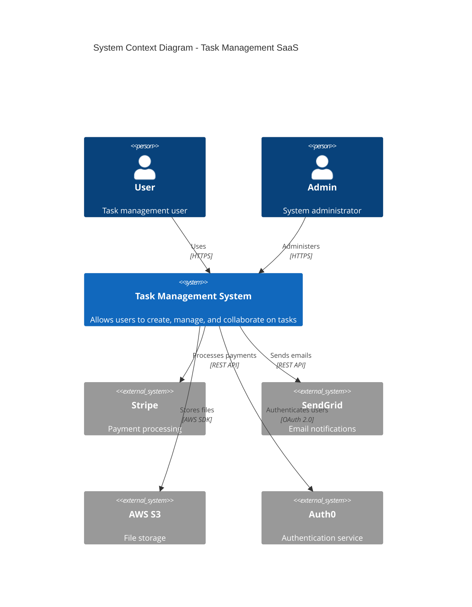
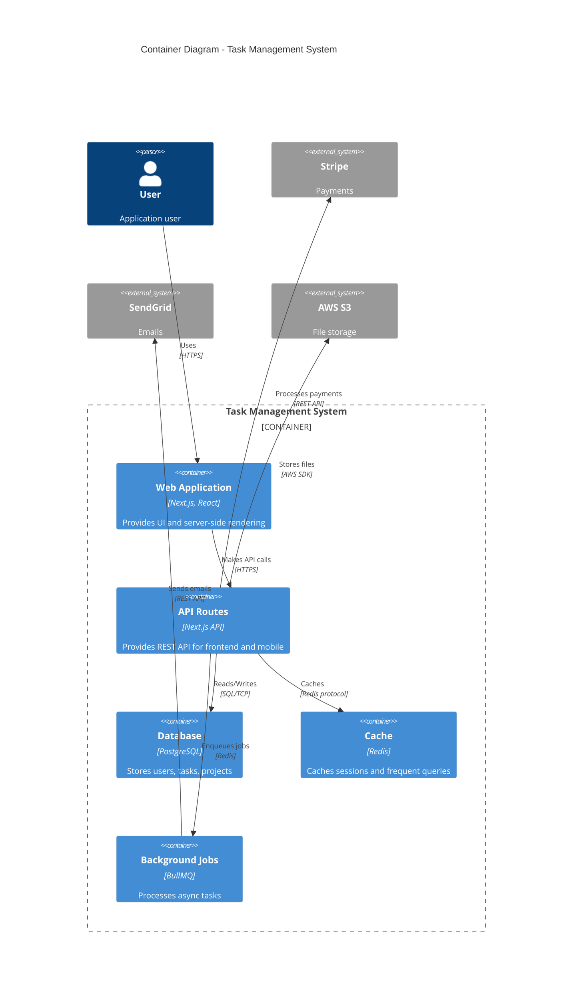
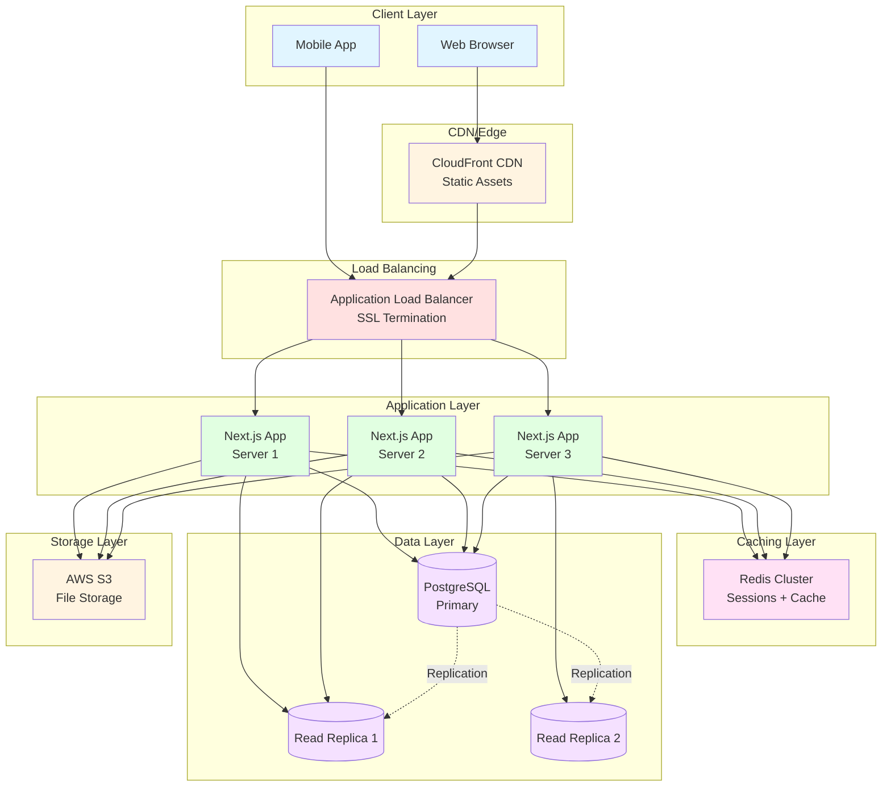
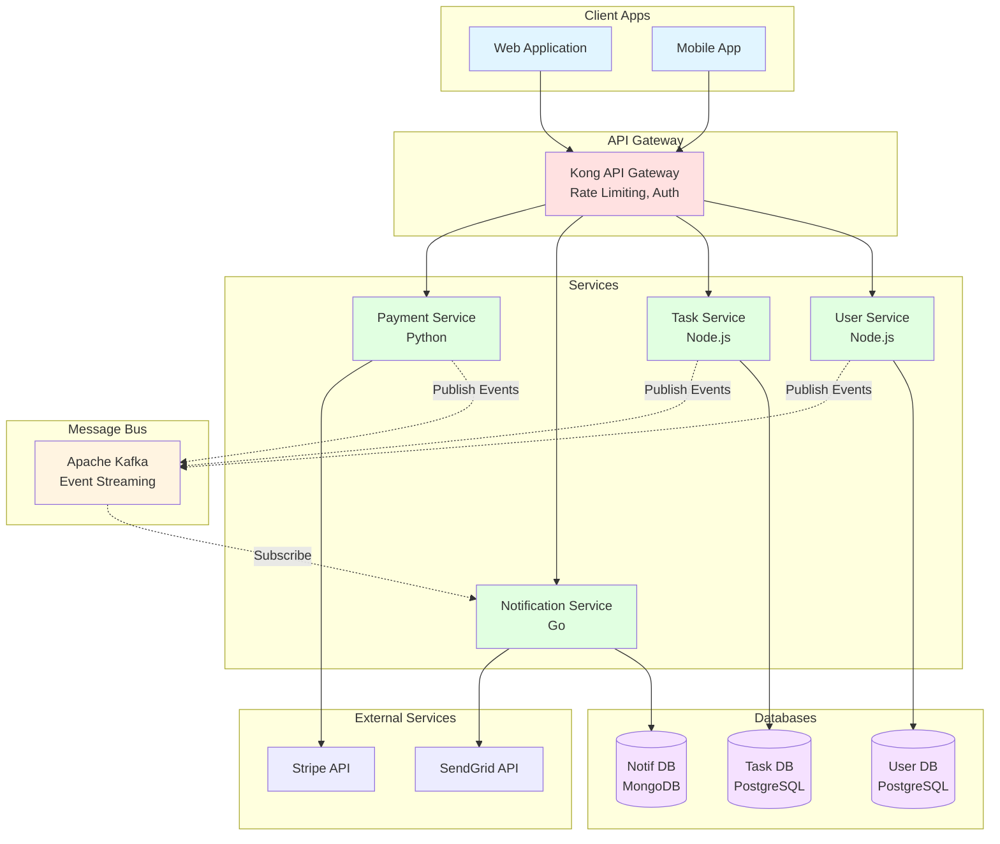
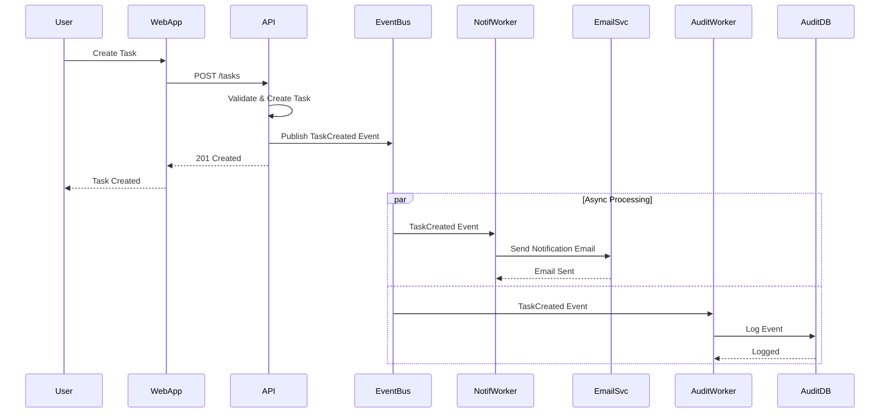
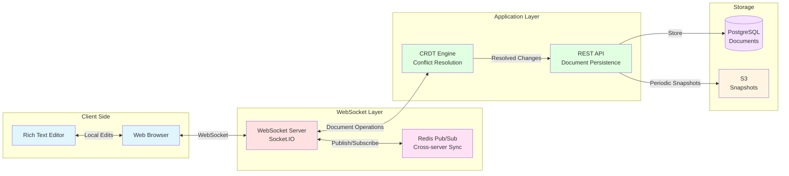

# Sample Architecture Diagrams

Architecture diagram examples in Mermaid format for different system types.

---

## Diagram 1: Full Stack SaaS Application (C4 Context Level)

### System Context Diagram



---

## Diagram 2: Container Diagram (Next.js Fullstack App)



---

## Diagram 3: High-Level Architecture (3-Tier Web App)



---

## Diagram 4: Microservices Architecture



---

## Diagram 5: Event-Driven Architecture



---

## Diagram 6: Deployment Architecture (AWS)

```mermaid
graph TB
    subgraph "Users"
        Users[Internet Users]
    end

    subgraph "AWS Cloud"
        subgraph "Edge"
            Route53[Route53<br/>DNS]
            CloudFront[CloudFront<br/>CDN]
        end

        subgraph "VPC - us-east-1"
            subgraph "Public Subnet"
                ALB[Application<br/>Load Balancer]
            end

            subgraph "Private Subnet - AZ1"
                App1[ECS Task<br/>Next.js App]
                RDS1[(RDS Primary<br/>PostgreSQL)]
            end

            subgraph "Private Subnet - AZ2"
                App2[ECS Task<br/>Next.js App]
                RDS2[(RDS Standby)]
            end

            subgraph "ElastiCache Subnet"
                Redis[ElastiCache<br/>Redis Cluster]
            end
        end

        subgraph "S3"
            S3Bucket[S3 Bucket<br/>File Storage]
        end
    end

    Users --> Route53
    Route53 --> CloudFront
    CloudFront --> ALB
    CloudFront --> S3Bucket

    ALB --> App1
    ALB --> App2

    App1 --> Redis
    App2 --> Redis

    App1 --> RDS1
    App2 --> RDS1

    RDS1 -.->|Replication| RDS2

    App1 --> S3Bucket
    App2 --> S3Bucket

    style Users fill:#e1f5ff
    style Route53 fill:#fff4e1
    style CloudFront fill:#fff4e1
    style ALB fill:#ffe1e1
    style App1 fill:#e1ffe1
    style App2 fill:#e1ffe1
    style Redis fill:#ffe1f5
    style RDS1 fill:#f5e1ff
    style RDS2 fill:#f5e1ff
    style S3Bucket fill:#fff4e1
```

---

## Diagram 7: Data Flow Diagram (Real-Time Collaboration)



---

## How to Use These Diagrams

### In Architecture Documents

```markdown
# System Architecture

## High-Level Overview

[Insert Diagram 3: High-Level Architecture here]

Our system follows a standard 3-tier architecture with CDN edge caching...

## Container View

[Insert Diagram 2: Container Diagram here]

The application consists of several containers that work together...
```

### Rendering Diagrams

These Mermaid diagrams can be rendered in:
- **GitHub/GitLab:** Native Mermaid support in markdown
- **VS Code:** Mermaid preview extensions
- **Notion:** Embed as code blocks (limited support)
- **Mermaid Live Editor:** https://mermaid.live for testing
- **Documentation sites:** Docusaurus, MkDocs support Mermaid

### Diagram Types

**C4 Model (Recommended):**
- **Context:** System and external dependencies
- **Container:** High-level containers (apps, databases, services)
- **Component:** Internal components of containers
- **Code:** Class diagrams (rarely needed in architecture docs)

**Flowcharts:**
- **Graph TB/LR:** Top-to-bottom or left-to-right layouts
- Good for deployment, data flow, service interactions

**Sequence Diagrams:**
- Show interactions over time
- Good for API flows, event-driven processes

### Best Practices

1. **Keep it simple:** Don't overcrowd diagrams
2. **Use consistent colors:** Group related components
3. **Label clearly:** Every box should have a clear label
4. **Show data flow:** Use arrows to show direction
5. **Include legends:** Explain symbols and colors
6. **Version control:** Diagrams in markdown (not images)
7. **Update regularly:** Keep diagrams in sync with reality

---

*Reference test fixture for create-architecture skill - Use these as examples when generating architecture diagrams*
