# Brownfield Getting Started Guide

**Version:** 1.0
**Last Updated:** 2025-10-28
**Estimated Time:** 1-2 hours for initial setup

---

## What is Brownfield Development?

**Brownfield** refers to working with an **existing codebase** rather than starting from scratch (greenfield). BMAD Enhanced's brownfield support helps you:

- 📝 **Generate documentation** automatically from code analysis
- 🔍 **Index existing code** for fast context lookup
- 📊 **Discover patterns** and conventions from the codebase
- 🎯 **Start using BMAD Enhanced** without rewriting everything

---

## Quick Decision: Is This Guide For You?

```mermaid
graph TD
    A[Do you have an existing codebase?] -->|Yes| B[Is it 10K-100K lines?]
    A -->|No| Z1[Use Greenfield Approach]
    B -->|Yes| C[Is it reasonably structured?]
    B -->|No, smaller| Z2[May not need automated docs]
    B -->|No, larger| Z3[Start with smaller subsystem]
    C -->|Yes| D[Is documentation missing/outdated?]
    C -->|No| Z4[Clean up structure first]
    D -->|Yes| E[✅ USE THIS GUIDE]
    D -->|No| Z5[Use existing docs]

    style E fill:#34a853,color:#fff
    style Z1 fill:#f0f0f0
    style Z2 fill:#f0f0f0
    style Z3 fill:#f0f0f0
    style Z4 fill:#f0f0f0
    style Z5 fill:#f0f0f0
```



**✅ Use this guide if:**
- You have 10K-100K lines of code
- Documentation is missing or outdated
- Code is reasonably structured
- You want to use BMAD Enhanced for new features

**❌ Not ready for this guide if:**
- Codebase < 10K lines (write docs manually)
- Codebase > 100K lines (start with subsystem)
- No clear structure (refactor first)
- Good documentation already exists (use it!)

---

## Overview: Brownfield Workflow


**Time Estimates:**
- **Step 1 (Setup):** 15 minutes
- **Step 2 (Analyze):** 30-60 minutes (depends on codebase size)
- **Step 3 (Index):** 15-30 minutes
- **Step 4 (Validate):** 30-60 minutes
- **Step 5 (Planning):** 15 minutes

**Total:** 1.5-3 hours

---

## Prerequisites

### Required

- ✅ Claude Code installed
- ✅ BMAD Enhanced installed
- ✅ Existing codebase (10K-100K lines recommended)
- ✅ Codebase in supported language:
  - **Excellent:** TypeScript, JavaScript, Python, Go, Java, Rust
  - **Basic:** PHP, Ruby, C#/.NET

### Recommended

- ✅ Version control (Git) with clean working directory
- ✅ Tests exist (for validation)
- ✅ Project builds successfully
- ✅ Dependencies installed

---

## Step 1: Setup Configuration

### 1.1 Update Project Type

Edit `.claude/config.yaml`:

```yaml
project:
  name: Your Project Name
  type: brownfield  # ← Change from 'greenfield' to 'brownfield'
  description: Your existing project description

# Add brownfield-specific settings
brownfield:
  codebasePath: src/              # Path to analyze
  existingDocs: []                # List existing docs to preserve
  includeTests: true              # Include test files in analysis
  maxFilesToAnalyze: 1000         # Safety limit
  documented: false               # Will be set to true after step 2
  indexed: false                  # Will be set to true after step 3
  indexLocation: .claude/index/   # Where to store search index
```

### 1.2 Verify Project Structure

```bash
# Check codebase path exists
ls src/

# Count files to be analyzed
find src/ -type f \( -name "*.ts" -o -name "*.js" -o -name "*.py" \) | wc -l

# Should be between 100-5000 files for optimal results
```

### 1.3 Check Existing Documentation

```bash
# Look for existing docs
ls docs/

# If docs exist, list them in config
# existingDocs:
#   - docs/old-architecture.md
#   - docs/api-spec.md
```

**Decision Point:**


---

## Step 2: Analyze & Generate Documentation

### 2.1 Run Document Project Skill

```bash
# Option A: Directly invoke skill
# (In Claude Code, use Skill tool)

# Option B: Use CLI (if available)
bmad-enhanced document-project --path src/
```

**What happens:**


### 2.2 Review Generated Documentation

**Generated Files:**

```
docs/
├── architecture.md         # System architecture (2,450 lines)
│   ├── Overview
│   ├── Tech Stack (95% confidence)
│   ├── Project Structure (90% confidence)
│   ├── Data Models (85% confidence)
│   ├── API Specifications (80% confidence)
│   └── Security Considerations
├── standards.md           # Development standards (850 lines)
│   ├── Security Standards
│   ├── Testing Standards
│   ├── Code Quality Standards
│   └── Performance Standards
├── patterns.md            # Design patterns (620 lines)
│   ├── Repository Pattern
│   ├── Dependency Injection
│   ├── Error Handling
│   └── Testing Patterns
└── REVIEW_CHECKLIST.md    # Human review tasks
    ├── High Priority (3 items)
    ├── Medium Priority (3 items)
    └── Low Priority (3 items)
```

**Confidence Scores:**

```mermaid
graph LR
    A[Overall: 85%] --> B[Tech Stack: 95%]
    A --> C[Structure: 90%]
    A --> D[Data Models: 85%]
    A --> E[API Specs: 80%]
    A --> F[Standards: 90%]

    B --> B1[✅ Excellent<br/>Trust this]
    C --> C1[✅ Very Good<br/>Minor review]
    D --> D1[⚠️ Good<br/>Review carefully]
    E --> E1[⚠️ Good<br/>Review carefully]
    F --> F1[✅ Very Good<br/>Minor review]

    style B1 fill:#34a853,color:#fff
    style C1 fill:#34a853,color:#fff
    style D1 fill:#fbbc04
    style E1 fill:#fbbc04
    style F1 fill:#34a853,color:#fff
```



### 2.3 Complete Human Review Checklist

Open `docs/REVIEW_CHECKLIST.md`:

```markdown
# Human Review Checklist

## High Priority (Review Required)

- [ ] **API Rate Limiting:** Not detected - verify if implemented
  - If exists: Document rate limits (e.g., 100 req/min per user)
  - If missing: Consider adding for production

- [ ] **Deployment Architecture:** Not in codebase - add manually
  - Document: AWS/GCP/Azure setup
  - Document: Database hosting
  - Document: CI/CD pipeline

- [ ] **Database Connection Pooling:** Not clearly evident
  - Verify: Prisma connection settings
  - Document: Pool size, timeout settings

## Medium Priority (Recommended Review)

- [ ] **Caching Strategy:** Not detected
  - If exists: Document Redis/Memcached usage
  - If missing: Note as future enhancement

- [ ] **Monitoring & Alerting:** Not in codebase
  - Add: CloudWatch/Datadog/Sentry documentation

- [ ] **Password Requirements:** Verify against security policy
  - Current: Min 8 chars, uppercase, lowercase, number, special
  - Update if policy requires more

## Low Priority (Nice to Have)

- [ ] Document code review process
- [ ] Add contribution guidelines
- [ ] Document release process
```

**Review Process:**

```mermaid
graph TD
    A[Open REVIEW_CHECKLIST.md] --> B{High Priority Items}
    B -->|Item 1: Rate Limiting| C[Check code for rate limiting]
    C -->|Found| D[Document in architecture.md]
    C -->|Not Found| E[Note as TODO or implement]

    B -->|Item 2: Deployment| F[Add deployment section]
    F --> G[Document infrastructure]

    B -->|Item 3: DB Pooling| H[Check Prisma config]
    H --> I[Document settings]

    D --> J[Mark item complete ✓]
    E --> J
    G --> J
    I --> J

    J --> K{More items?}
    K -->|Yes| B
    K -->|No| L[Review complete!]

    style L fill:#34a853,color:#fff
```



### 2.4 Enhance Generated Documentation

**Add missing sections manually:**

```markdown
# architecture.md - Add these sections

## Deployment Architecture

**Infrastructure:**
- Platform: AWS
- Database: RDS PostgreSQL 15
- Application: ECS Fargate containers
- Load Balancer: ALB with SSL termination

**Environments:**
- Development: dev.example.com
- Staging: staging.example.com
- Production: api.example.com

## Monitoring & Alerting

**Monitoring:**
- CloudWatch for infrastructure metrics
- Datadog for application performance
- Sentry for error tracking

**Alerts:**
- CPU > 80% for 5 minutes
- Error rate > 1% for 5 minutes
- Response time p95 > 500ms
```

### 2.5 Update Configuration

After review is complete:

```yaml
brownfield:
  documented: true  # ← Set to true
  existingDocs:     # ← List generated docs
    - docs/architecture.md
    - docs/standards.md
    - docs/patterns.md
```

---

## Step 3: Index Documentation & Code

### 3.1 Run Index Docs Skill

```bash
# Run indexing skill
bmad-enhanced index-docs --docs docs/ --code src/
```

**What happens:**


### 3.2 Review Generated Index Files

**Generated Index Structure:**

```
.claude/index/
├── search.json          # Fast lookup: keyword → documents
├── quick-ref.md         # Quick reference guide
└── glossary.md          # Terminology glossary
```

**Example: quick-ref.md**

```markdown
# Quick Reference Guide

## Data Models

- **User:** [architecture.md#data-models](../docs/architecture.md#data-models)
  - Implementation: `src/models/user.ts`
  - Tests: `tests/models/user.test.ts`

- **Order:** [architecture.md#data-models](../docs/architecture.md#data-models)
  - Implementation: `src/models/order.ts`
  - Tests: `tests/models/order.test.ts`

## API Endpoints

- **POST /api/auth/signup:** [architecture.md#api-specs](../docs/architecture.md#api-specs)
  - Handler: `src/routes/auth/signup.ts:15`
  - Service: `src/services/auth/signup.service.ts:25`
  - Tests: `tests/integration/auth/signup.test.ts`

## Design Patterns

- **Repository Pattern:** [patterns.md#repository](../docs/patterns.md#repository)
  - Example: `src/repositories/user.repository.ts`
```

**Example: glossary.md**

```markdown
# Glossary

## Technical Terms

**JWT (JSON Web Token)**
- Used for: Authentication
- Implementation: `src/middleware/auth.ts`
- Documentation: [architecture.md#authentication](../docs/architecture.md#authentication)

**Repository Pattern**
- Used for: Data access abstraction
- Examples: `src/repositories/*.repository.ts`
- Documentation: [patterns.md#repository](../docs/patterns.md#repository)

**Zod**
- Used for: Request validation
- Examples: `src/schemas/*.schema.ts`
- Documentation: [standards.md#validation](../docs/standards.md#validation)
```

### 3.3 Test Search Functionality

**Try searching for concepts:**

```bash
# Search for "User model"
grep -i "user" .claude/index/search.json

# Should return:
# - docs/architecture.md#data-models
# - src/models/user.ts
# - src/services/auth/signup.service.ts
```

### 3.4 Update Configuration

```yaml
brownfield:
  documented: true
  indexed: true      # ← Set to true
  indexLocation: .claude/index/
```

---

## Step 4: Validate & Enhance

### 4.1 Validate Generated Documentation

**Validation Checklist:**

```mermaid
graph TD
    A[Start Validation] --> B{Tech Stack Accurate?}
    B -->|Yes| C{Data Models Correct?}
    B -->|No| B1[Update architecture.md]
    C -->|Yes| D{API Specs Match?}
    C -->|No| C1[Fix data models section]
    D -->|Yes| E{Standards Realistic?}
    D -->|No| D1[Correct API documentation]
    E -->|Yes| F{Patterns Consistent?}
    E -->|No| E1[Adjust standards]
    F -->|Yes| G[✅ Validation Complete]
    F -->|No| F1[Update patterns]

    B1 --> C
    C1 --> D
    D1 --> E
    E1 --> F
    F1 --> G

    style G fill:#34a853,color:#fff
```



**Quick Validation Commands:**

```bash
# 1. Validate tech stack
cat docs/architecture.md | grep -A 20 "Tech Stack"
npm list --depth=0  # Compare with documented dependencies

# 2. Validate data models
cat docs/architecture.md | grep -A 50 "Data Models"
cat prisma/schema.prisma  # Compare with documented models

# 3. Validate API endpoints
cat docs/architecture.md | grep -A 100 "API Specifications"
grep -r "router\." src/routes/  # List all endpoints

# 4. Check confidence scores
cat docs/architecture.md | grep "Confidence:"
```

### 4.2 Fill In Gaps

**Common gaps to fill:**

| Gap | Where to Add | Why Important |
|-----|--------------|---------------|
| Rate limiting | architecture.md → API Specs | Production requirement |
| Deployment | architecture.md → New section | Operations need this |
| Monitoring | architecture.md → New section | Debugging production issues |
| Database pooling | architecture.md → Tech Stack | Performance critical |
| Environment vars | standards.md → Configuration | Developer onboarding |
| Release process | standards.md → New section | Consistent deployments |

### 4.3 Add Domain Knowledge

**Generated docs lack business context. Add it:**

```markdown
# architecture.md - Add Business Context section

## Business Context

**Domain:** E-commerce platform for small businesses

**Key Workflows:**
1. Customer Registration → Browse Products → Add to Cart → Checkout
2. Merchant Registration → Add Products → Manage Orders → Analytics

**Business Rules:**
- Orders over $50 get free shipping
- Refunds allowed within 30 days
- Merchants pay 2.9% + $0.30 per transaction

**Key Metrics:**
- Conversion rate: 3.2%
- Average order value: $67
- Customer lifetime value: $450
```

### 4.4 Version Control

```bash
# Commit generated documentation
git add docs/
git add .claude/index/
git add .claude/config.yaml
git commit -m "docs: add brownfield documentation (auto-generated)"

# Create branch for manual enhancements
git checkout -b docs/enhance-brownfield
# ... make manual enhancements ...
git commit -m "docs: enhance with deployment and monitoring info"
```

---

## Step 5: Start Planning Features

### 5.1 Verify Documentation is Ready

```mermaid
graph TD
    A[Ready to Plan?] --> B{Docs generated?}
    B -->|Yes| C{Docs reviewed?}
    B -->|No| Z1[Go back to Step 2]
    C -->|Yes| D{Confidence ≥70%?}
    C -->|No| Z2[Complete review checklist]
    D -->|Yes| E{Index created?}
    D -->|No| Z3[Enhance docs in Step 4]
    E -->|Yes| F[✅ Ready to Plan!]
    E -->|No| Z4[Run index-docs in Step 3]

    style F fill:#34a853,color:#fff
    style Z1 fill:#ea4335,color:#fff
    style Z2 fill:#fbbc04
    style Z3 fill:#fbbc04
    style Z4 fill:#ea4335,color:#fff
```



### 5.2 Create First Task Specification

Now you can use the planning workflow:

```bash
# Use Alex (Planner) to create task spec
@alex create-task-spec
```

**Alex will:**
1. Load architecture.md and standards.md (your brownfield docs!)
2. Gather requirements from you
3. Extract context from docs (with source references)
4. Create task specification with embedded context
5. Save to `.claude/tasks/`

**Example Interaction:**

```
You: @alex create-task-spec

Alex: I'll create a task specification using your brownfield documentation.

What feature would you like to implement?

You: Add password reset functionality

Alex: Great! Let me gather context from your documentation...

✓ Loaded docs/architecture.md
✓ Loaded docs/standards.md
✓ Found existing auth patterns

I found these relevant sections in your docs:
- User model with email field [architecture.md#data-models]
- Password hashing with bcrypt cost 12 [standards.md#password-security]
- Email service integration [architecture.md#external-apis]
- JWT token generation [architecture.md#authentication]

Let me ask a few clarifying questions...

1. Should password reset use email verification codes or magic links?
2. How long should reset tokens be valid?
3. Should we send confirmation email after password is changed?

[... planning continues ...]
```

### 5.3 Normal BMAD Enhanced Workflow

From here, the workflow is identical to greenfield:


---

## Common Issues & Solutions

### Issue 1: Documentation Confidence Too Low (<70%)

```mermaid
graph TD
    A[Low Confidence] --> B{Which section?}
    B -->|Tech Stack| C[Check package.json/requirements.txt]
    B -->|Data Models| D[Check schema files]
    B -->|API Specs| E[Check route files]
    B -->|Standards| F[Check ESLint/Prettier config]

    C --> G[Update manually in architecture.md]
    D --> G
    E --> G
    F --> H[Update manually in standards.md]

    G --> I[Re-run validation]
    H --> I
    I --> J[Confidence improved?]
    J -->|Yes| K[✅ Proceed]
    J -->|No| L[Consider subset analysis]

    style K fill:#34a853,color:#fff
```



**Solution:** Focus on high-confidence sections, manually fill gaps for low-confidence areas.

### Issue 2: Codebase Too Large (>100K lines)


**Solution:** Start with one subsystem (e.g., auth module), document it, test workflow, then expand.

### Issue 3: No Clear Structure


**Solution:** Either refactor to add structure, or write documentation manually.

### Issue 4: Mixed Languages/Frameworks


**Solution:** Document primary language fully, note others as external dependencies.

---

## Best Practices

### 1. Start Small


Don't try to document everything at once. Start with one feature area or module.

### 2. Validate Early

Run validation checks after every step, not at the end.

### 3. Enhance Gradually

Generated docs are a starting point. Enhance with:
- Business context
- Deployment details
- Team processes
- Historical decisions

### 4. Keep Docs Fresh

Re-run `document-project` every 3-6 months to catch drift.

### 5. Use Index for Speed

Use quick-ref.md and glossary.md during planning to quickly find context.

---

## Troubleshooting

### Problem: Skill Takes Too Long

```bash
# Reduce scope
brownfield:
  maxFilesToAnalyze: 500  # Default 1000
  includeTests: false     # Skip test files
```

### Problem: Inaccurate API Documentation

**Cause:** Complex routing or middleware

**Solution:** Manually document API in architecture.md, mark as "manually documented"

### Problem: Cannot Find Patterns

**Cause:** Codebase too small or inconsistent

**Solution:** Write standards manually based on desired patterns, use as guide going forward

---

## Next Steps After Setup

Once brownfield setup is complete:

1. **Create first task** - Use planning workflow
2. **Implement feature** - Use implementation workflow
3. **Quality review** - Use review workflow with refactoring
4. **Iterate** - Each task improves documentation

**Congratulations!** 🎉 Your brownfield project is now ready for BMAD Enhanced workflows!

---

## Appendix: Supported Languages

### Excellent Support

| Language | Confidence | Notes |
|----------|------------|-------|
| TypeScript | 90-95% | Best support, full type analysis |
| JavaScript | 85-90% | Good support, limited type info |
| Python | 85-90% | Good support with type hints |
| Go | 85-90% | Good support, struct analysis |
| Java | 80-85% | Good support, annotation detection |
| Rust | 80-85% | Good support, trait analysis |

### Basic Support

| Language | Confidence | Notes |
|----------|------------|-------|
| PHP | 70-75% | Basic support, manual enhancement needed |
| Ruby | 70-75% | Basic support, manual enhancement needed |
| C#/.NET | 70-75% | Basic support, manual enhancement needed |

### Detection Methods


---

## Quick Reference Card

**Print this or keep it handy:**

```
┌─────────────────────────────────────────────┐
│  BMAD Enhanced Brownfield Quick Reference   │
├─────────────────────────────────────────────┤
│                                             │
│  Setup (15 min):                            │
│  □ Update config.yaml (type: brownfield)    │
│  □ Set codebasePath: src/                   │
│                                             │
│  Document (30-60 min):                      │
│  □ Run: document-project skill              │
│  □ Review: docs/architecture.md             │
│  □ Complete: REVIEW_CHECKLIST.md            │
│  □ Set: documented: true                    │
│                                             │
│  Index (15-30 min):                         │
│  □ Run: index-docs skill                    │
│  □ Review: .claude/index/quick-ref.md       │
│  □ Set: indexed: true                       │
│                                             │
│  Plan (15 min):                             │
│  □ Use: @alex create-task-spec              │
│  □ Context auto-loaded from brownfield docs │
│                                             │
│  Implement & Review:                        │
│  □ Standard BMAD Enhanced workflow          │
│                                             │
└─────────────────────────────────────────────┘
```

---

**Version:** 1.0
**Need Help?** Open GitHub Discussion or check docs/ROADMAP.md
