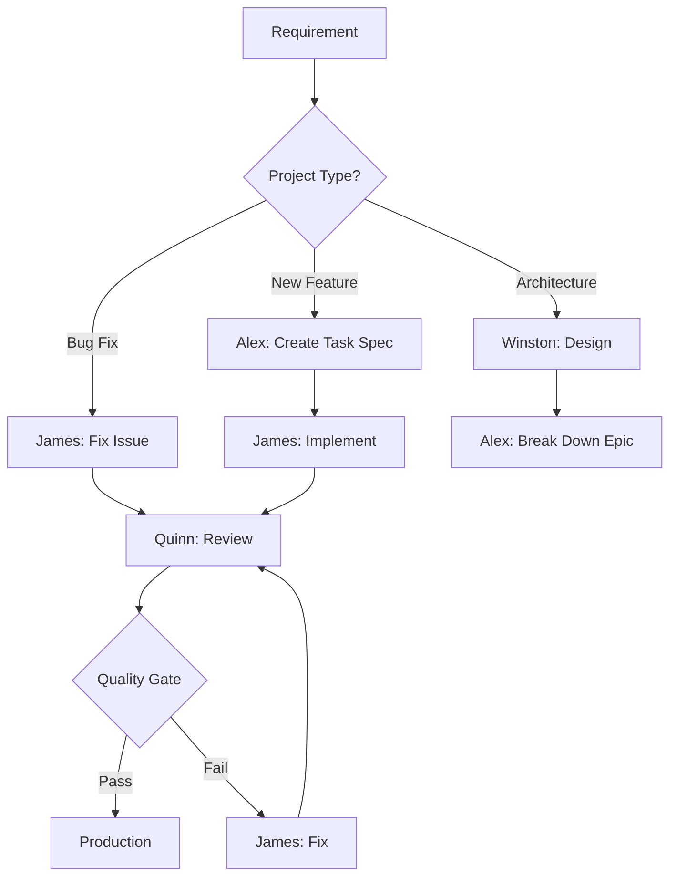
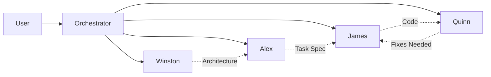
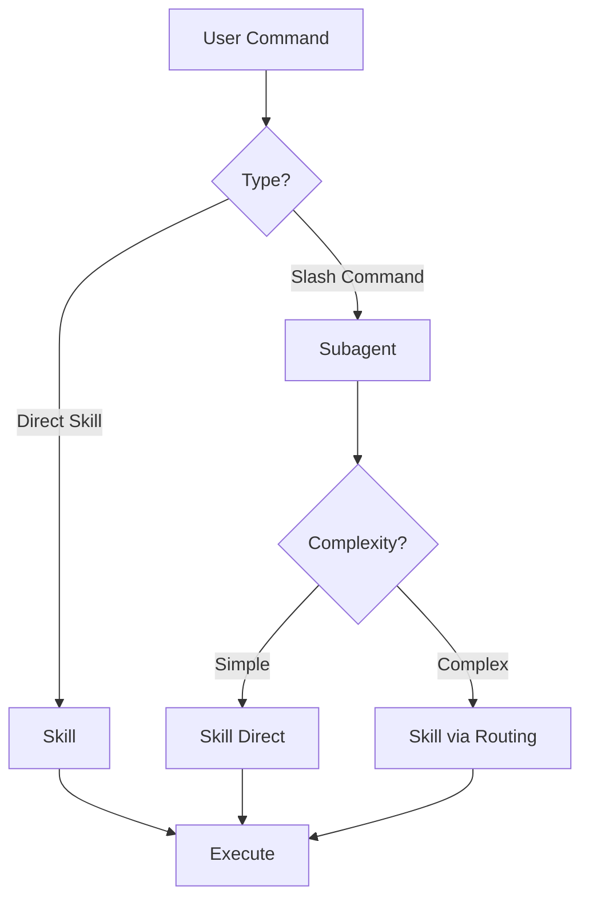
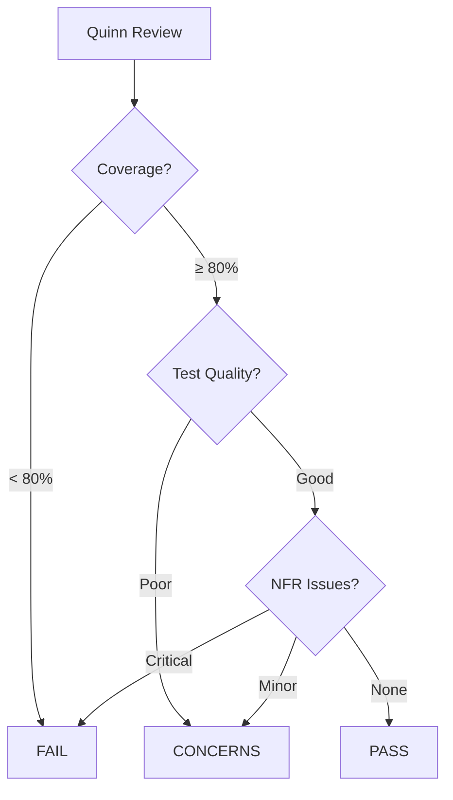
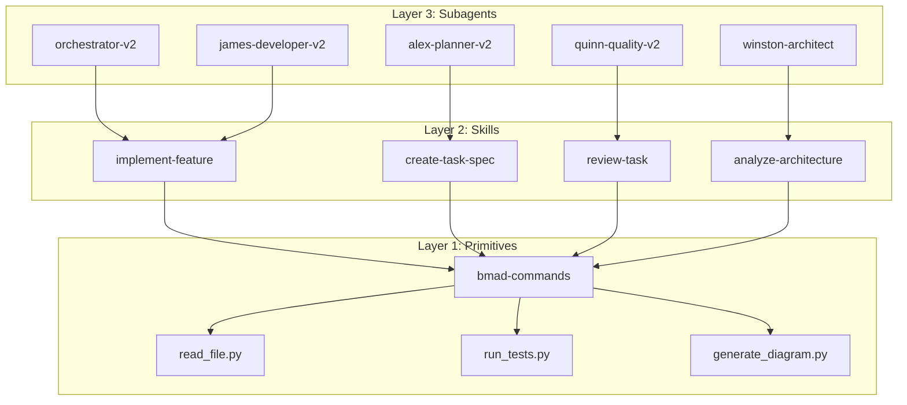

# Documentation Enhancement Analysis

**Date:** 2025-11-10
**Purpose:** Analyze BMAD Method V4 documentation and plan enhancements for BMAD Enhanced

---

## Executive Summary

### Key Findings

**BMAD Method V4 Strengths:**
- Clear Mermaid workflow diagrams (planning + development cycles)
- Excellent transition guidance (web UI → IDE)
- Strong Test Architect integration throughout workflow
- Simple, focused user guide (577 lines)
- Well-defined artifact paths

**BMAD Enhanced Current State:**
- Comprehensive documentation (40 files, 34,000+ lines)
- Excellent technical depth
- Missing workflow visualizations
- Best practices scattered across multiple files
- Documentation could be simplified and better organized

### Recommended Enhancements

1. **Add Mermaid Diagrams** - Visual workflow representations
2. **Consolidate Best Practices** - Single authoritative guide
3. **Simplify Documentation Structure** - Reduce redundancy
4. **Improve Navigation** - Better cross-references
5. **Add Use Case Guidance** - When to use commands vs skills vs subagents

---

## Detailed Comparison

### 1. Documentation Structure

#### BMAD Method V4
```
docs/
├── user-guide.md                    (577 lines) ⭐ Main entry point
├── core-architecture.md             (Mermaid diagrams)
├── enhanced-ide-development-workflow.md
├── working-in-the-brownfield.md
├── expansion-packs.md
├── versions.md
└── GUIDING-PRINCIPLES.md
```

**Strengths:**
- Simple, focused structure
- Clear main entry point (user-guide.md)
- Workflow-specific guides
- Visual diagrams throughout

**Weaknesses:**
- Limited technical depth
- Fewer reference materials
- Basic troubleshooting

#### BMAD Enhanced Current
```
docs/
├── USER-GUIDE.md                   (1,878 lines) ⭐ Main entry point
├── DOCUMENTATION-INDEX.md          (409 lines) ⭐ Navigation hub
├── QUICK-START.md
├── WORKFLOW-GUIDE.md               (3,360 lines)
├── BEST-PRACTICES.md               (1,103 lines)
├── TROUBLESHOOTING.md              (1,309 lines)
├── AGENT-REFERENCE.md              (1,444 lines)
├── COMMAND-REFERENCE-SUMMARY.md
├── V2-ARCHITECTURE.md              (2,500+ lines)
├── quickstart-*.md                 (5 files)
├── architecture/                   (2 files)
├── api/                            (1 file)
├── archive/                        (12 files)
└── [30+ additional files]
```

**Strengths:**
- Comprehensive coverage
- Excellent technical depth
- Multiple entry points
- Role-specific guides
- Production-ready documentation

**Weaknesses:**
- Overwhelming for new users
- Some redundancy across files
- Missing visual workflow diagrams
- Best practices scattered
- Complex navigation

---

## 2. Visual Documentation

### V4 Approach
- **Planning Workflow Diagram** (Mermaid)
  - 18 steps with decision points
  - Color-coded by agent type
  - Clear transitions

- **Development Cycle Diagram** (Mermaid)
  - 28 steps with quality gates
  - Test Architect integration
  - Decision trees

### Enhanced Current
- **No workflow diagrams** ❌
- Architecture diagrams in text
- Workflow descriptions in prose

### Recommendation
✅ **Add comprehensive Mermaid diagrams:**
1. Overall BMAD Enhanced workflow
2. Agent routing and interactions
3. Command/skill invocation flows
4. Quality gate decision trees
5. Architecture component relationships

---

## 3. Best Practices Documentation

### V4 Approach
- Integrated into user guide
- Test Architect best practices inline
- IDE integration tips scattered

### Enhanced Current
- **BEST-PRACTICES.md** (1,103 lines)
- **HOW-TO-USE-AGENTS-CORRECTLY.md** (478 lines)
- **AGENT-ROUTING-GUIDE.md** (785 lines)
- **COMMAND-ROUTING-GUIDE.md** (300+ lines)
- Additional tips in USER-GUIDE.md

**Issues:**
- Information spread across 5+ files
- Some duplication
- Difficult to find specific guidance
- No clear hierarchy

### Recommendation
✅ **Create consolidated BEST-PRACTICES.md:**
1. **When to Use What**
   - Commands vs skills vs subagents
   - Direct invocation vs Task tool
   - Simple vs complex workflows

2. **Subagent Usage**
   - When to use each subagent
   - Correct invocation syntax
   - Common patterns

3. **Workflow Orchestration**
   - Single-agent workflows
   - Multi-agent coordination
   - Error handling

4. **Performance Optimization**
   - Token efficiency
   - Skill loading strategies
   - Caching patterns

---

## 4. Content Consolidation Opportunities

### Files to Consolidate

**Group 1: Getting Started**
- ✅ Keep: QUICK-START.md
- ✅ Keep: USER-GUIDE.md (enhanced)
- ✅ Keep: INSTALLATION-GUIDE.md
- ❓ Consider merging: WHY-BMAD-ENHANCED.md → README.md section

**Group 2: Agent References**
- ✅ Keep: AGENT-REFERENCE.md (comprehensive)
- ✅ Keep: quickstart-*.md (5 files - practical guides)
- ⚠️ Consolidate: HOW-TO-USE-AGENTS-CORRECTLY.md → BEST-PRACTICES.md

**Group 3: Commands & Skills**
- ✅ Keep: COMMAND-REFERENCE-SUMMARY.md
- ⚠️ Consolidate: COMMAND-ROUTING-GUIDE.md → BEST-PRACTICES.md
- ⚠️ Consolidate: AGENT-ROUTING-GUIDE.md → BEST-PRACTICES.md

**Group 4: Workflows**
- ✅ Keep: WORKFLOW-GUIDE.md (examples)
- ✅ Keep: EXAMPLE-WORKFLOWS.md (copy-paste ready)
- ✅ Keep: ADVANCED-WORKFLOW-CUSTOMIZATION.md

**Group 5: Architecture**
- ✅ Keep: V2-ARCHITECTURE.md (master reference)
- ✅ Keep: 3-layer-architecture-for-skills.md
- ⚠️ Consider: HYBRID-ARCHITECTURE-IMPLEMENTATION.md → archive

**Group 6: Production**
- ✅ Keep all 5 production guides (distinct purposes)

**Group 7: Development**
- ✅ Keep: TROUBLESHOOTING.md
- ✅ Keep: ERROR-CODES.md
- ✅ Keep: FRAMEWORK-SUPPORT-MATRIX.md
- ⚠️ Archive: COMMAND-AUDIT.md (internal tool)

**Group 8: Brownfield**
- ✅ Keep: BROWNFIELD-GETTING-STARTED.md
- ⚠️ Consolidate: brownfield-workflow-guide.md → BROWNFIELD-GETTING-STARTED.md

### Consolidation Plan

**Target Reductions:**
- Current: 40 active files
- Target: 28-30 active files
- Archive: 15-20 files (historical reference)

**New Consolidated Files:**

1. **BEST-PRACTICES.md (Enhanced)**
   - Merge: HOW-TO-USE-AGENTS-CORRECTLY.md
   - Merge: COMMAND-ROUTING-GUIDE.md
   - Merge: AGENT-ROUTING-GUIDE.md
   - Add: Use case decision trees
   - Add: Workflow patterns
   - Result: ~2,500 lines (comprehensive guide)

2. **USER-GUIDE.md (Enhanced)**
   - Add: Mermaid workflow diagrams
   - Add: Visual agent interaction flows
   - Improve: Getting started section
   - Add: Quick reference tables
   - Result: ~2,500 lines (with diagrams)

3. **BROWNFIELD-GUIDE.md (Consolidated)**
   - Merge: BROWNFIELD-GETTING-STARTED.md
   - Merge: brownfield-workflow-guide.md
   - Add: Mermaid diagrams
   - Result: ~1,500 lines

---

## 5. Navigation Improvements

### Current Issues
- Documentation index is comprehensive but long
- Some cross-references broken
- Difficult to find "next steps"
- Role-based navigation exists but could be clearer

### Recommendations

1. **Improve DOCUMENTATION-INDEX.md**
   - Add visual navigation tree
   - Group by experience level (beginner/intermediate/advanced)
   - Add estimated reading times
   - Clear "start here" paths

2. **Enhance Cross-References**
   - Consistent linking format
   - "Next steps" at end of each document
   - "Related guides" sections
   - Breadcrumb navigation

3. **Add Navigation Aids**
   - Quick reference cards
   - Command cheat sheets
   - Decision flowcharts

---

## 6. Mermaid Diagrams Plan

### Diagrams to Add

**1. BMAD Enhanced Overall Workflow**


**2. Agent Routing & Interaction**


**3. Command/Skill Invocation Flow**


**4. Quality Gate Decision Tree**


**5. 3-Layer Architecture**


---

## 7. Implementation Plan

### Phase 1: Analysis & Planning ✅ COMPLETE
- [x] Analyze V4 documentation
- [x] Compare with Enhanced current state
- [x] Identify consolidation opportunities
- [x] Plan Mermaid diagrams
- [x] Create implementation roadmap

### Phase 2: Content Enhancement
- [ ] Create enhanced USER-GUIDE.md with Mermaid diagrams
- [ ] Consolidate BEST-PRACTICES.md
- [ ] Add use case decision trees
- [ ] Enhance BROWNFIELD-GUIDE.md

### Phase 3: Documentation Consolidation
- [ ] Merge identified files
- [ ] Archive superseded content
- [ ] Update cross-references
- [ ] Fix broken links

### Phase 4: Navigation Improvement
- [ ] Update DOCUMENTATION-INDEX.md
- [ ] Add navigation aids
- [ ] Create quick reference cards
- [ ] Add breadcrumbs

### Phase 5: Validation
- [ ] Review all changes
- [ ] Test all links
- [ ] Verify completeness
- [ ] Generate change summary

---

## 8. Success Criteria

**Documentation Quality:**
- ✅ Visual workflows with Mermaid diagrams
- ✅ Consolidated best practices (single source)
- ✅ Clear use case guidance
- ✅ Simplified structure (28-30 files)
- ✅ Improved navigation
- ✅ All cross-references working

**User Experience:**
- ✅ New users can get started in < 10 minutes
- ✅ Clear path from beginner → advanced
- ✅ Easy to find specific information
- ✅ Visual learning aids available
- ✅ Comprehensive but not overwhelming

**Technical Completeness:**
- ✅ All features documented
- ✅ All commands explained
- ✅ All workflows covered
- ✅ Production-ready guidance
- ✅ Troubleshooting comprehensive

---

## Next Steps

1. ✅ Complete this analysis
2. ⏳ Create enhanced USER-GUIDE.md with diagrams
3. ⏳ Consolidate BEST-PRACTICES.md
4. ⏳ Merge and archive files
5. ⏳ Update DOCUMENTATION-INDEX.md
6. ⏳ Generate final change summary

---

**Analysis Complete:** 2025-11-10
**Analyst:** Orchestrator-v2 + Winston-Architect collaboration
