```mermaid
graph LR
    A[Long Method<br/>80 lines] --> B[Identify<br/>Logical Blocks]
    B --> C[Extract Block 1<br/>→ validateInput]
    C --> D[Extract Block 2<br/>→ processData]
    D --> E[Extract Block 3<br/>→ formatResponse]
    E --> F[Short Method<br/>15 lines]

    style A fill:#ffebee
    style F fill:#e8f5e9
```

# Automated Refactoring Guide

**Version:** 1.0
**Last Updated:** 2025-10-28
**Skill:** `.claude/skills/quality/refactor-code.md`

---

## What is Automated Refactoring?

**Refactoring** means improving code structure without changing behavior. BMAD Enhanced's automated refactoring:

- 🔄 **Applies safe refactorings** automatically during quality review
- ✅ **Runs tests after each change** to ensure correctness
- ⏪ **Automatically rolls back** if tests fail
- 📊 **Logs all changes** with rationale
- 🎯 **Three aggressiveness levels** to control risk

---

## Quick Decision: Should You Use Automated Refactoring?


**✅ Use automated refactoring when:**
- Tests exist and pass (critical!)
- Quality review identified issues
- You want to improve code systematically
- You trust test-driven safety

**❌ Do NOT use when:**
- No tests exist
- Tests are failing
- Code is critical and risky
- You want to manually review every change

---

## Overview: Refactoring Workflow

```mermaid
graph TD
    A[Implementation Complete] --> B[Quality Review]
    B --> C[Quality Issues Found]
    C --> D[Enable Refactoring?]

    D -->|Yes| E[Choose Aggressiveness]
    D -->|No| F[Manual Review Only]

    E --> G[Conservative<br/>Low-risk only]
    E --> H[Moderate<br/>Recommended]
    E --> I[Aggressive<br/>All opportunities]

    G --> J[Apply Refactorings]
    H --> J
    I --> J

    J --> K[Run Tests After Each]
    K --> L{Tests Pass?}

    L -->|Yes| M[Keep Changes]
    L -->|No| N[Automatic Rollback]

    M --> O{More Refactorings?}
    N --> O

    O -->|Yes| J
    O -->|No| P[Log All Changes]

    P --> Q[Update Quality Gate]
    Q --> R[✅ Refactoring Complete]

    F --> Q

    style R fill:#34a853,color:#fff
    style N fill:#ea4335,color:#fff
    style L fill:#fbbc04
```



---

## Configuration

### Enable Refactoring

Edit `.claude/config.yaml`:

```yaml
quality:
  review:
    # Enable automated refactoring
    allowRefactoring: true  # Set to false to disable

    # Aggressiveness level
    refactoringAggressiveness: moderate  # conservative | moderate | aggressive

    # Safety requirements
    requireTestsPass: true  # Must have passing tests (always recommended)

    # Log location
    refactoringLog: .claude/quality/refactoring-log.md
```

### Aggressiveness Levels


**Conservative (Low-Risk):**
- Only critical issues (P0)
- Very safe refactorings (rename, extract variable)
- Minimal behavior change risk
- **Recommended for:** First time, critical code

**Moderate (Recommended):**
- Critical + high priority (P0 + P1)
- Safe refactorings (extract method, simplify conditionals)
- Good balance of safety and improvement
- **Recommended for:** Normal development, most projects

**Aggressive (All Opportunities):**
- All priorities (P0 + P1 + P2)
- All refactorings (including extract class, move method)
- Maximum improvement, higher risk
- **Recommended for:** Non-critical code, heavy refactoring needed

---

## Safety Guarantees

### Test-Driven Safety


### Safety Rules

1. **One Refactoring at a Time**
   - Never batch multiple refactorings
   - Test after each change
   - Isolate failures

2. **Automatic Rollback**
   - Tests fail → instant rollback
   - Original code restored
   - No partial changes

3. **Full Traceability**
   - Every change logged
   - Rationale documented
   - Source files tracked

4. **Behavior Preservation**
   - All refactorings behavior-preserving
   - Tests verify correctness
   - No functionality changes

5. **User Control**
   - Choose aggressiveness level
   - Can disable refactoring
   - Review all changes in log

---

## Refactoring Decision Tree

### When to Apply Each Refactoring


---

## Refactoring Patterns

### Pattern 1: Extract Method

**When:** Method is too long (>50 lines) or has complex logic block

**Risk:** Medium

**Process:**



**Example:**

```typescript
// Before: 80 lines, complex
async function signup(req, res) {
  // 30 lines of validation
  if (!req.body.email) return res.status(400).json({...});
  if (!isValidEmail(req.body.email)) return res.status(400).json({...});
  if (!req.body.password) return res.status(400).json({...});
  if (req.body.password.length < 8) return res.status(400).json({...});
  // ... more validation

  // 30 lines of business logic
  const existingUser = await db.user.findUnique({ where: { email } });
  if (existingUser) return res.status(409).json({...});
  const hashedPassword = await bcrypt.hash(password, 12);
  const user = await db.user.create({ data: { email, password: hashedPassword } });
  // ... more logic

  // 20 lines of response formatting
  const token = jwt.sign({ userId: user.id }, SECRET);
  const userResponse = { id: user.id, email: user.email };
  return res.status(201).json({ user: userResponse, token });
}

// After: 15 lines, clear structure
async function signup(req, res) {
  const validation = validateSignupRequest(req.body);
  if (!validation.valid) return res.status(400).json(validation.errors);

  const user = await createUser(req.body.email, req.body.password);
  const response = formatSignupResponse(user);

  return res.status(201).json(response);
}

// Extracted: validateSignupRequest() - 30 lines
// Extracted: createUser() - 30 lines
// Extracted: formatSignupResponse() - 20 lines
```

### Pattern 2: Extract Variable

**When:** Complex expression used multiple times or hard to understand

**Risk:** Low

**Process:**


**Example:**

```typescript
// Before: Complex, repeated
if (user.role === 'admin' && user.permissions.includes('write') && !user.suspended) {
  // ...
}
if (user.role === 'admin' && user.permissions.includes('write') && !user.suspended) {
  // ...
}

// After: Clear, DRY
const canWrite = user.role === 'admin' &&
                 user.permissions.includes('write') &&
                 !user.suspended;
if (canWrite) {
  // ...
}
if (canWrite) {
  // ...
}
```

### Pattern 3: Rename

**When:** Variable, function, or class name is unclear

**Risk:** Low

**Process:**


**Example:**

```typescript
// Before: Unclear
const u = await findUser(email);
if (u) return error;

// After: Clear
const existingUserWithEmail = await findUserByEmail(email);
if (existingUserWithEmail) return conflict();
```

### Pattern 4: Remove Duplication

**When:** Same code appears 2+ times

**Risk:** Low-Medium

**Process:**


**Example:**

```typescript
// Before: Duplicated (80% similar)
async function signup(email, password) {
  const hashedPassword = await bcrypt.hash(password, 12);
  // ...
}

async function resetPassword(email, newPassword) {
  const hashedPassword = await bcrypt.hash(newPassword, 12);
  // ...
}

// After: DRY
async function hashPassword(password: string): Promise<string> {
  return bcrypt.hash(password, 12);
}

async function signup(email, password) {
  const hashedPassword = await hashPassword(password);
  // ...
}

async function resetPassword(email, newPassword) {
  const hashedPassword = await hashPassword(newPassword);
  // ...
}
```

### Pattern 5: Simplify Conditional

**When:** Nested if/else chains (>3 levels deep)

**Risk:** Medium

**Process:**


**Example:**

```typescript
// Before: Nested (4 levels)
function getDiscount(user) {
  if (user.isPremium) {
    if (user.orderCount > 10) {
      if (user.orderTotal > 1000) {
        return 0.20;
      } else {
        return 0.15;
      }
    } else {
      return 0.10;
    }
  } else {
    if (user.orderCount > 5) {
      return 0.05;
    } else {
      return 0;
    }
  }
}

// After: Guard clauses (1-2 levels)
function getDiscount(user) {
  // Non-premium, few orders
  if (!user.isPremium && user.orderCount <= 5) return 0;

  // Non-premium, some orders
  if (!user.isPremium) return 0.05;

  // Premium, few orders
  if (user.orderCount <= 10) return 0.10;

  // Premium, many orders, small total
  if (user.orderTotal <= 1000) return 0.15;

  // Premium, many orders, large total
  return 0.20;
}
```

### Pattern 6: Extract Class

**When:** Class has too many responsibilities (violates SRP)

**Risk:** High

**Process:**


**Example:**

```typescript
// Before: UserService does too much
class UserService {
  // User CRUD
  createUser() { }
  updateUser() { }
  deleteUser() { }

  // Authentication
  login() { }
  logout() { }
  verifyToken() { }

  // Email
  sendWelcomeEmail() { }
  sendPasswordResetEmail() { }

  // Analytics
  trackUserActivity() { }
  generateUserReport() { }
}

// After: Separated concerns
class UserService {
  createUser() { }
  updateUser() { }
  deleteUser() { }
}

class AuthService {
  login() { }
  logout() { }
  verifyToken() { }
}

class EmailService {
  sendWelcomeEmail() { }
  sendPasswordResetEmail() { }
}

class AnalyticsService {
  trackUserActivity() { }
  generateUserReport() { }
}
```

---

## Risk Assessment Matrix


### Risk Factors

| Factor | Low Risk | Medium Risk | High Risk |
|--------|----------|-------------|-----------|
| **Scope** | Single function | Single module | Multiple modules |
| **Dependencies** | None | Few (2-5) | Many (>5) |
| **Test Coverage** | 100% | 80-99% | <80% |
| **Age** | Recent | Months old | Years old |
| **Usage** | Internal only | Used by few | Public API |

---

## Usage: Step-by-Step

### Step 1: Complete Quality Review

```mermaid
graph LR
    A[Implementation Done] --> B[@quinn *review task-001]
    B --> C[Quality Assessment]
    C --> D[Issues Identified]
    D --> E{Refactoring Available?}
    E -->|Yes| F[Prompt User]
    E -->|No| G[Manual Review Only]

    style F fill:#fff3e0
```

### Step 2: Choose Refactoring Option

When quality review completes, you'll see:

```
Quality Review Complete

Issues Identified:
- 3 code quality issues
- 2 technical debt items
- 1 duplication found

Automated refactoring is available.

Options:
A) Skip refactoring (proceed to quality gate)
B) Conservative refactoring (low-risk improvements only)
C) Moderate refactoring (recommended improvements) ← RECOMMENDED
D) Aggressive refactoring (all identified opportunities)

Which option would you like?
```

### Step 3: Refactoring Executes


### Step 4: Review Results

```
Refactoring Complete!

Summary:
- Refactorings attempted: 3
- Successfully applied: 3
- Failed (rolled back): 0
- Duration: 8 minutes

Changes Made:
1. ✓ Extracted validation logic → src/utils/validation.ts
   - Rationale: Separation of concerns
   - Impact: Improved testability
   - Tests: All passing (45/45)

2. ✓ Extracted hashPassword method → src/utils/password.ts
   - Rationale: Remove duplication (used in 2 places)
   - Impact: DRY principle, reusability
   - Tests: All passing (45/45)

3. ✓ Renamed existingUser → existingUserWithEmail
   - Rationale: Improve clarity
   - Impact: Self-documenting code
   - Tests: All passing (45/45)

Quality Impact:
- Code complexity: -27%
- Duplication: -80%
- Test coverage: +2%
- Maintainability: Improved

Next Steps:
1. Review refactored code (git diff)
2. Verify changes align with your style
3. Commit: "refactor: improve code quality (automated)"

Detailed log: .claude/quality/refactoring-log.md
```

### Step 5: Review Detailed Log

Open `.claude/quality/refactoring-log.md`:

```markdown
## Refactoring Session: task-001 - 2025-10-28

**Scope:** Moderate (P0 + P1)
**Duration:** 8 minutes
**Success Rate:** 3/3 (100%)

### Refactorings Applied

#### 1. Extract Validation Logic
- **File:** src/routes/auth/signup.ts:15-30
- **Type:** Extract Method
- **Risk:** Medium
- **Priority:** P1 (High)
- **Rationale:** Validation in route handler (quality issue)
- **Before:**
  ```typescript
  if (!req.body.email) return res.status(400).json({...});
  if (!isValidEmail(req.body.email)) return res.status(400).json({...});
  // ... 28 more lines
  ```
- **After:**
  ```typescript
  const validation = validateSignupRequest(req.body);
  if (!validation.valid) return res.status(400).json(validation.errors);
  ```
- **Impact:** 30 lines → 3 lines (-90%), improved testability
- **Tests:** ✓ All passing (45/45)

#### 2. Extract hashPassword Method
- **File:** src/services/auth/signup.service.ts:34-35
- **Type:** Extract Method
- **Risk:** Low
- **Priority:** P1 (High)
- **Rationale:** Technical debt - inline hashing, used in multiple places
- **Before:**
  ```typescript
  const hashedPassword = await bcrypt.hash(password, 12);
  ```
- **After:**
  ```typescript
  const hashedPassword = await hashPassword(password);

  // New utility function
  async function hashPassword(password: string): Promise<string> {
    return bcrypt.hash(password, 12);
  }
  ```
- **Impact:** Reusable, consistent hashing, easier to test
- **Tests:** ✓ All passing (45/45)

### Files Modified
- src/routes/auth/signup.ts (30 lines → 15 lines, -50%)
- src/services/auth/signup.service.ts (47 lines → 52 lines, +10%)
- src/utils/validation.ts (0 lines → 35 lines, new file)
- src/utils/password.ts (0 lines → 20 lines, new file)
```

### Step 6: Commit Changes

```bash
# Review changes
git diff

# Commit refactorings separately
git add src/
git commit -m "refactor: improve code quality (automated)

- Extract validation logic for separation of concerns
- Extract password hashing for reusability
- Rename variables for clarity

All tests passing (45/45)
Code complexity reduced 27%
Duplication reduced 80%"
```

---

## Best Practices

### 1. Start Conservative


**First refactoring session:** Use conservative mode to build confidence.

### 2. Review Changes

Always review refactored code before committing:

```bash
# See what changed
git diff

# Review specific files
git diff src/routes/auth/signup.ts

# Check refactoring log
cat .claude/quality/refactoring-log.md
```

### 3. Commit Separately

```bash
# Good: Separate commits
git commit -m "feat: add password reset"
git commit -m "refactor: extract validation (automated)"

# Bad: Mixed commits
git commit -m "add password reset and refactor"
```

### 4. Monitor Impact

Track improvements over time:

```bash
# Check code quality metrics
npm run lint
npm run complexity

# Compare before/after
git show HEAD~1:src/routes/auth/signup.ts | wc -l  # Before
cat src/routes/auth/signup.ts | wc -l              # After
```

### 5. Trust the Tests

```mermaid
graph TD
    A[Tests Pass After Refactoring] --> B{Trust the tests?}
    B -->|Yes| C[✅ Refactoring Safe]
    B -->|No| D[⚠️ Need Better Tests]

    D --> E[Write More Tests]
    E --> F[Re-run Refactoring]

    style C fill:#34a853,color:#fff
    style D fill:#fbbc04
```



**If tests pass:** Changes are safe (behavior preserved)
**If uncertain:** Write more tests, then refactor

---

## Troubleshooting

### Problem: Refactoring Failed, Tests Not Passing


**Action:** Automatic rollback protected you! Review the refactoring logic or skip it.

### Problem: Too Many Files Changed

```yaml
# Reduce scope
quality:
  review:
    refactoringAggressiveness: conservative  # Fewer changes
```

### Problem: Refactorings Not Aggressive Enough

```yaml
# Increase scope
quality:
  review:
    refactoringAggressiveness: aggressive  # More opportunities
```

### Problem: Want Manual Control

```yaml
# Disable automated refactoring
quality:
  review:
    allowRefactoring: false  # Manual review only
```

Then refactor manually and run tests yourself.

---

## Common Patterns by Language

### TypeScript/JavaScript

**Common Refactorings:**
1. Extract validation to utility functions
2. Extract types to interfaces
3. Simplify async/await chains
4. Remove callback hell (→ async/await)

**Example:**
```typescript
// Before: Callback hell
function getUser(id, callback) {
  db.findUser(id, (err, user) => {
    if (err) return callback(err);
    db.getOrders(user.id, (err, orders) => {
      if (err) return callback(err);
      callback(null, { user, orders });
    });
  });
}

// After: Async/await
async function getUser(id) {
  const user = await db.findUser(id);
  const orders = await db.getOrders(user.id);
  return { user, orders };
}
```

### Python

**Common Refactorings:**
1. Extract list comprehensions
2. Replace loops with map/filter/reduce
3. Extract decorators for common patterns
4. Simplify exception handling

### Go

**Common Refactorings:**
1. Extract error handling patterns
2. Extract defer cleanup patterns
3. Simplify goroutine management
4. Extract interface definitions

---

## Appendix: Full Refactoring Catalog

### By Priority


### By Risk Level

| Refactoring | Risk | Effort | Impact |
|-------------|------|--------|--------|
| Rename | Low | Low | Low |
| Extract Variable | Low | Low | Low |
| Inline | Low | Low | Low |
| Extract Method | Medium | Medium | Medium |
| Remove Duplication | Medium | Medium | Medium |
| Simplify Conditional | Medium | Medium | Medium |
| Extract Class | High | High | High |
| Move Method | High | High | High |
| Change Signature | High | High | High |

---

## Quick Reference Card

**Print this or keep it handy:**

```
┌─────────────────────────────────────────────┐
│  BMAD Enhanced Refactoring Quick Reference  │
├─────────────────────────────────────────────┤
│                                             │
│  Prerequisites:                             │
│  □ Tests exist and pass                     │
│  □ allowRefactoring: true in config         │
│                                             │
│  During Quality Review:                     │
│  □ Quinn identifies issues                  │
│  □ Prompt for refactoring option            │
│  □ Choose: Conservative|Moderate|Aggressive │
│                                             │
│  Automated Process:                         │
│  □ Apply refactoring                        │
│  □ Run tests                                │
│  □ If pass: Keep changes                    │
│  □ If fail: Automatic rollback              │
│                                             │
│  After Refactoring:                         │
│  □ Review: .claude/quality/refactoring-log  │
│  □ Check: git diff                          │
│  □ Commit: "refactor: ..." (separate)       │
│                                             │
│  Safety Guarantees:                         │
│  ✓ One change at a time                     │
│  ✓ Tests after each change                  │
│  ✓ Automatic rollback on failure            │
│  ✓ Full traceability                        │
│                                             │
└─────────────────────────────────────────────┘
```

---

**Version:** 1.0
**Skill:** `.claude/skills/quality/refactor-code.md`
**Need Help?** Check skill documentation or open GitHub Discussion
