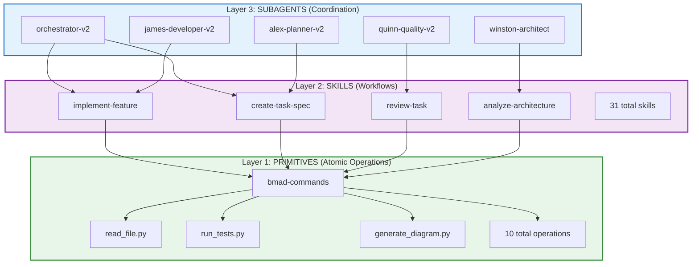
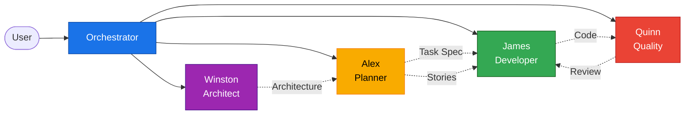
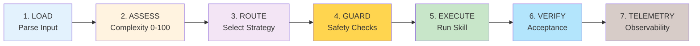
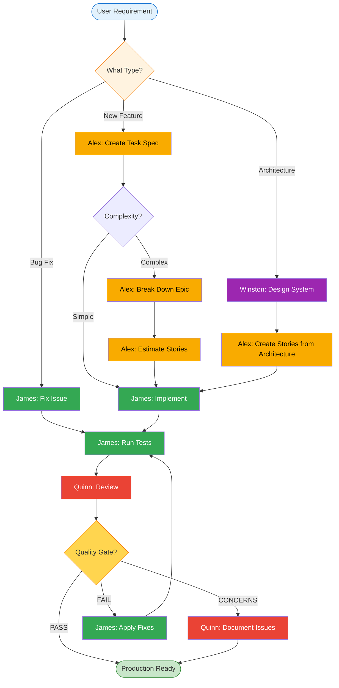
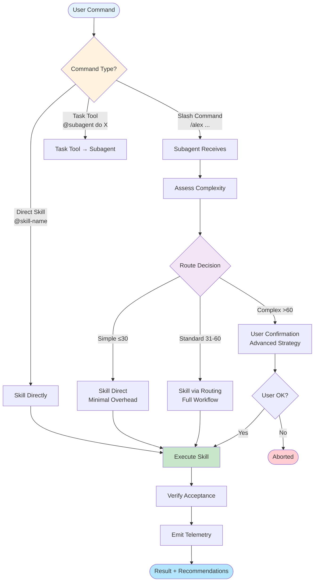
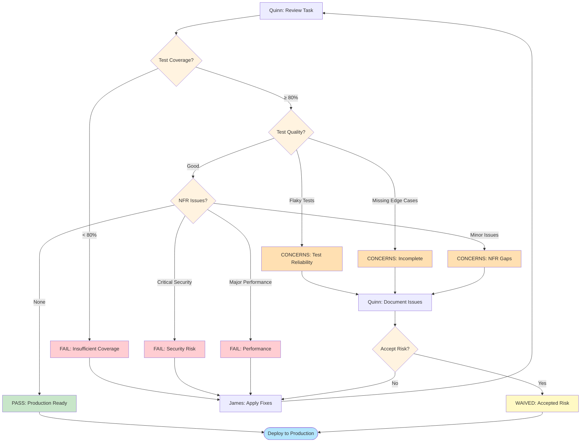
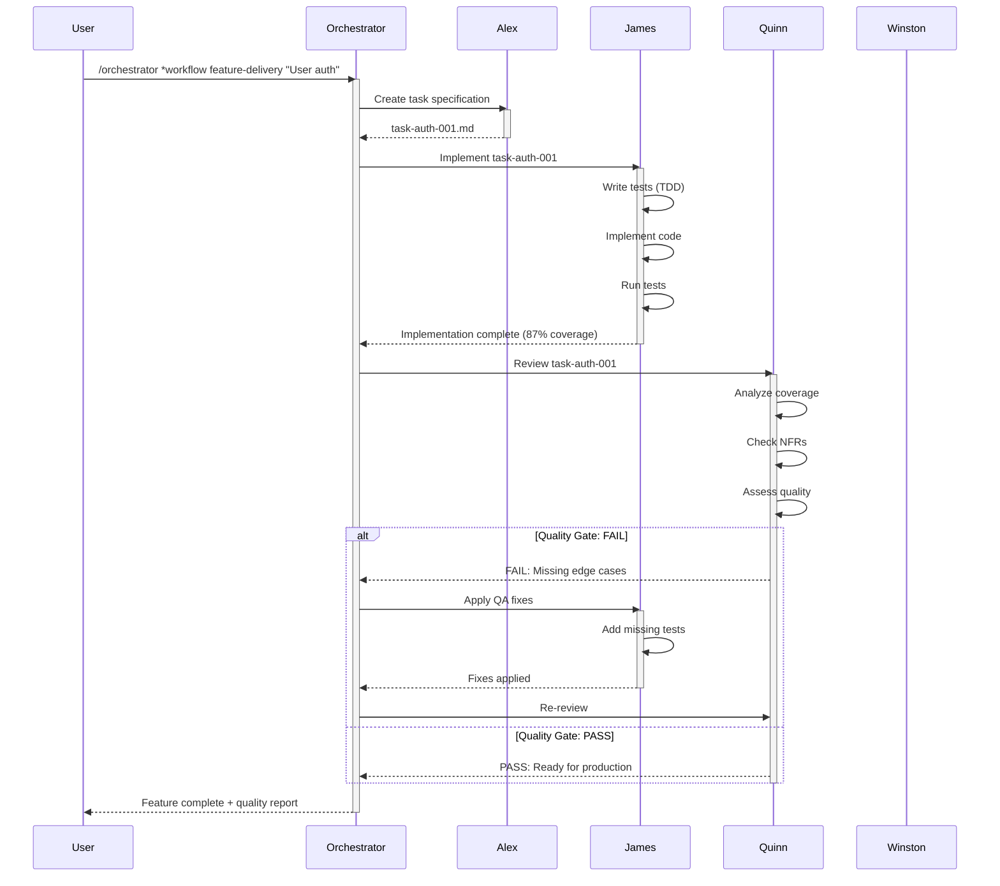
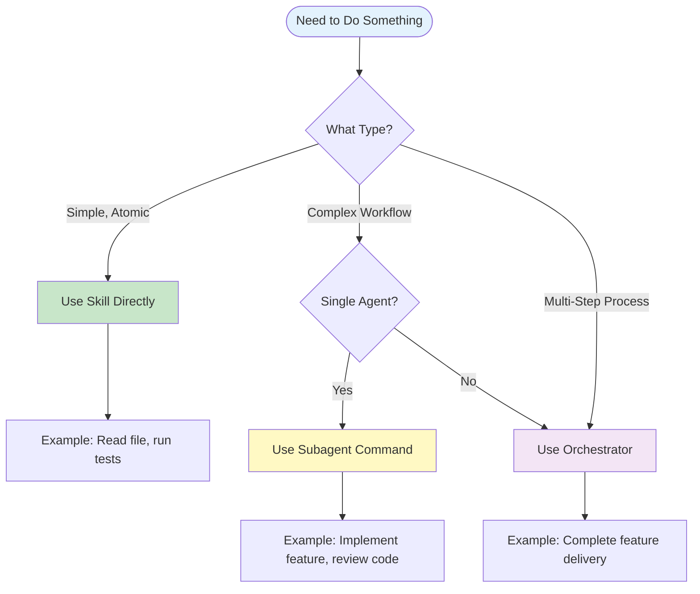

# BMAD Enhanced - User Guide

**Comprehensive guide to creating and maintaining software products with AI agents**

**Version:** 2.1 | **Status:** Production Ready | **Last Updated:** 2025-11-10

---

## Table of Contents

1. [Introduction & Overview](#1-introduction--overview)
2. [Quick Start](#2-quick-start)
3. [Architecture Explained](#3-architecture-explained)
4. [Workflow Visualizations](#4-workflow-visualizations)
5. [Working with Each Agent](#5-working-with-each-agent)
6. [Common Workflows](#6-common-workflows)
7. [Best Practices Guide](#7-best-practices-guide)
8. [Command Reference](#8-command-reference)
9. [Configuration & Customization](#9-configuration--customization)
10. [Troubleshooting](#10-troubleshooting)

---

## 1. Introduction & Overview

### 1.1 What is BMAD Enhanced?

BMAD Enhanced is a production-ready AI agent system built natively for Claude Code that transforms traditional software development workflows. By coordinating specialized AI agents through an intelligent 3-layer architecture, it reduces development time by 85-90% while maintaining high quality standards.

**Break My AGILE Down - Enhanced Edition**

The name reflects the core mission: break down complex AGILE ceremonies (sprint planning, story breakdown, estimation, implementation, QA) into AI-assisted workflows that complete in minutes rather than hours.

### 1.2 Key Benefits

**For Developers:**
- **Faster Implementation:** TDD-driven feature development in 20-30 minutes
- **Better Quality:** Automated testing with 80%+ coverage guaranteed
- **Reduced Context Switching:** Agents handle coordination and handoffs
- **Learning Aid:** Explains code, generates documentation, teaches patterns

**For Teams:**
- **Consistent Quality:** Every feature follows same high standards
- **Predictable Velocity:** Complexity assessment provides accurate estimates
- **Reduced Technical Debt:** Quality gates prevent shortcuts
- **Better Documentation:** Automatically generated and maintained

**For Projects:**
- **85-90% Time Savings:** From requirement to production-ready code
- **Higher Test Coverage:** TDD enforcement ensures 80%+ coverage
- **Observable Workflows:** Full telemetry tracks every operation
- **Portable Skills:** Reusable capabilities across projects

### 1.3 Core Metrics

| Metric | Before BMAD | After BMAD | Improvement |
|--------|-------------|------------|-------------|
| **Planning Time** | 2-4 hours | 8-12 minutes | 83% reduction |
| **Implementation Time** | 4-8 hours | 20-30 minutes | 87% reduction |
| **Review Time** | 2-3 hours | 10-15 minutes | 83% reduction |
| **Total Feature Time** | 10-17 hours | 48-63 minutes | 85-90% reduction |
| **Test Coverage** | 40-60% | 80-95% | 2x improvement |
| **Quality Score** | Variable | Consistent 80+ | Standardized |

### 1.4 Use Cases

**Primary Use Case: Software Product Development**

BMAD Enhanced excels at:
- Creating new features from requirements
- Fixing bugs systematically
- Improving code quality
- Planning sprints and epics
- Analyzing and modernizing codebases
- Designing system architecture
- Maintaining documentation

**When to Use BMAD Enhanced:**
- Building greenfield applications
- Maintaining brownfield systems
- Modernizing legacy codebases
- Improving quality standards
- Scaling development velocity
- Learning best practices

---

## 2. Quick Start

### 2.1 5-Minute Getting Started

**Step 1: Verify Installation**
```bash
# Check BMAD Enhanced structure
ls .claude/
# Should see: agents/, commands/, skills/
```

**Step 2: Run Your First Command**
```bash
# Example 1: Create a task specification
/alex *create-task-spec "Add user login validation"

# Example 2: Implement a simple feature
/james *implement task-001

# Example 3: Review code quality
/quinn *review task-001
```

**Step 3: Try a Complete Workflow**
```bash
# Full feature delivery workflow
/orchestrator *workflow feature-delivery "User password reset functionality"
```

### 2.2 Your First Feature (15 Minutes)

**Scenario:** Add email validation to user signup

**Workflow:**
```bash
# 1. Plan the feature (2 min)
/alex *create-task-spec "Add email validation to user signup with RFC 5322 compliance"
# Output: .claude/tasks/task-auth-001.md

# 2. Implement with tests (8 min)
/james *implement task-auth-001
# Output: Code + tests with 85%+ coverage

# 3. Quality review (3 min)
/quinn *review task-auth-001
# Output: Quality gate decision + recommendations

# 4. Fix any issues (2 min, if needed)
/james *apply-qa-fixes task-auth-001
```

**Result:** Production-ready feature in 15 minutes with comprehensive tests and quality validation!

### 2.3 Common Commands Cheat Sheet

| What You Want | Command | Example |
|---------------|---------|---------|
| **Plan a feature** | `/alex *create-task-spec` | `/alex *create-task-spec "OAuth integration"` |
| **Break down epic** | `/alex *breakdown-epic` | `/alex *breakdown-epic epic-auth.md` |
| **Implement feature** | `/james *implement` | `/james *implement task-001` |
| **Fix a bug** | `/james *fix` | `/james *fix "Login fails with special chars"` |
| **Run tests** | `/james *test` | `/james *test src/auth/` |
| **Review code** | `/quinn *review` | `/quinn *review task-001` |
| **Design architecture** | `/winston *create-architecture` | `/winston *create-architecture prd.md` |
| **Complete workflow** | `/orchestrator *workflow` | `/orchestrator *workflow feature-delivery "..."` |

**See [Section 8: Command Reference](#8-command-reference) for complete command documentation.**

---

## 3. Architecture Explained

### 3.1 The 3-Layer Architecture

BMAD Enhanced uses a unique 3-layer architecture where skills remain portable and packageable - the layers define HOW skills work together, not different file structures.



**Layer 1: Primitives** - Atomic, testable operations
- 10 Python scripts in `bmad-commands` skill
- Deterministic: same inputs → same outputs
- Observable: structured JSON output with telemetry
- Framework-agnostic: supports ANY test framework

**Layer 2: Skills** - Reusable workflow capabilities
- 31 skills in `.claude/skills/` directory
- Portable: packageable as .zip files
- Composable: skills call other skills
- Token-efficient: progressive disclosure (52% average reduction)

**Layer 3: Subagents** - Intelligent coordination
- 5 core + 5 persona agents in `.claude/agents/`
- Intelligent routing based on complexity
- Comprehensive guardrails
- Full telemetry and observability

### 3.2 Core Subagents



**Orchestrator (Coordinator)**
- **Role:** Workflow orchestration and cross-subagent coordination
- **Commands:** 2 (*workflow, *coordinate)
- **Use When:** Running complete workflows, coordinating multiple agents
- **Example:** `/orchestrator *workflow feature-delivery "User authentication"`

**Alex (Planner)**
- **Role:** Planning, requirements, and estimation
- **Commands:** 5 (*create-task-spec, *breakdown-epic, *estimate, *refine-story, *plan-sprint)
- **Use When:** Planning features, breaking down work, estimating effort
- **Example:** `/alex *create-task-spec "Implement password reset"`

**James (Developer)**
- **Role:** Implementation with Test-Driven Development
- **Commands:** 7 (*implement, *fix, *test, *refactor, *apply-qa-fixes, *debug, *explain)
- **Use When:** Writing code, fixing bugs, running tests
- **Example:** `/james *implement task-001`
- **Framework Support:** Auto-detects Jest, Pytest, JUnit, GTest, Cargo, Go test

**Quinn (Quality)**
- **Role:** Quality assurance and risk assessment
- **Commands:** 5 (*review, *assess-nfr, *validate-quality-gate, *trace-requirements, *assess-risk)
- **Use When:** Reviewing code, assessing quality, making gate decisions
- **Example:** `/quinn *review task-001`

**Winston (Architect)**
- **Role:** System architecture and design
- **Commands:** 5 (*analyze-architecture, *create-architecture, *review-architecture, *validate-story, *compare-architectures)
- **Use When:** Designing systems, analyzing codebases, making technology decisions
- **Example:** `/winston *create-architecture prd.md`

### 3.3 The V2 Pattern: 7-Step Workflow

Every command follows a consistent 7-step pattern for predictable, observable execution:



**Step Breakdown:**

1. **LOAD:** Parse input and load context
   - Validate parameters
   - Load required skills
   - Set up workspace

2. **ASSESS:** Calculate complexity (0-100 scale)
   - Analyze scope, dependencies, risk
   - Categorize as Simple/Standard/Complex
   - Select appropriate strategy

3. **ROUTE:** Select execution strategy
   - Simple (≤30): Quick, minimal overhead
   - Standard (31-60): Full workflow, state persistence
   - Complex (>60): User confirmation, advanced recovery

4. **GUARD:** Check guardrails and safety constraints
   - Validate preconditions
   - Check resource availability
   - Verify permissions

5. **EXECUTE:** Run selected skill/strategy
   - Progressive disclosure (load only what's needed)
   - Emit progress updates
   - Handle errors gracefully

6. **VERIFY:** Validate acceptance criteria
   - Check output quality
   - Validate completeness
   - Generate recommendations

7. **TELEMETRY:** Emit structured observability data
   - Duration, complexity, route taken
   - Success/failure metrics
   - Recommendations for improvement

---

## 4. Workflow Visualizations

### 4.1 Complete Feature Delivery Workflow



### 4.2 Command/Skill Invocation Flow



### 4.3 Quality Gate Decision Tree



### 4.4 Agent Interaction Patterns



---

## 5. Working with Each Agent

### 5.1 Orchestrator - Workflow Coordinator

**Purpose:** Coordinate complete workflows across multiple subagents with state management and error recovery.

**Key Commands:**

| Command | Purpose | Example |
|---------|---------|---------|
| `*workflow` | Execute end-to-end workflow | `/orchestrator *workflow feature-delivery "User login"` |
| `*coordinate` | Cross-subagent coordination | `/orchestrator *coordinate "Architecture + Planning" --subagents winston,alex` |

**Available Workflows:**

1. **feature-delivery** - Requirement to PR
   ```bash
   /orchestrator *workflow feature-delivery "Add two-factor authentication"
   ```
   - Phases: Planning → Implementation → Review → PR
   - Duration: ~45-60 minutes
   - Output: Production-ready feature with tests

2. **epic-to-sprint** - Epic breakdown to sprint plan
   ```bash
   /orchestrator *workflow epic-to-sprint "User Authentication System" --velocity 40
   ```
   - Phases: Breakdown → Estimation → Sprint Planning
   - Duration: ~10-15 minutes
   - Output: Sprint plan with prioritized stories

3. **sprint-execution** - Execute complete sprint
   ```bash
   /orchestrator *workflow sprint-execution "Sprint 15" --velocity 40
   ```
   - Phases: Story loop (implement + review) → Review → Retrospective
   - Duration: Varies by sprint size
   - Output: Completed stories with quality reports

4. **modernize** - Brownfield modernization
   ```bash
   /orchestrator *workflow modernize . "Scale to 100K users"
   ```
   - Phases: Analysis → PRD → Architecture → Comparison → Implementation Plan
   - Duration: ~40-60 minutes
   - Output: Modernization roadmap with options

5. **document-codebase** - Complete documentation
   ```bash
   /orchestrator *workflow document-codebase . --depth comprehensive
   ```
   - Phases: Architecture → Code → Guides → Review → Finalization
   - Duration: ~60-75 minutes
   - Output: Comprehensive documentation suite

**When to Use Orchestrator:**
- Complete feature delivery (planning → production)
- Multi-step workflows requiring coordination
- Sprint planning and execution
- Codebase modernization
- Documentation generation

**When NOT to Use:**
- Single, isolated tasks (use specific subagent)
- Ad-hoc exploration
- Manual step-by-step control desired

**See:** [quickstart-orchestrator.md](./quickstart-orchestrator.md) for detailed examples

### 5.2 Alex - Planner

**Purpose:** Transform requirements into implementable specifications with accurate effort estimates.

**Key Commands:**

| Command | Purpose | Example |
|---------|---------|---------|
| `*create-task-spec` | Create detailed task specification | `/alex *create-task-spec "OAuth integration"` |
| `*breakdown-epic` | Break epic into user stories | `/alex *breakdown-epic epic-auth.md` |
| `*estimate` | Estimate story points | `/alex *estimate story-001.md story-002.md` |
| `*refine-story` | Enhance story with details | `/alex *refine-story story-001.md` |
| `*plan-sprint` | Create sprint plan from stories | `/alex *plan-sprint --velocity 40` |

**Typical Workflow:**

```bash
# 1. Create task specification
/alex *create-task-spec "Add email verification to user registration"
# Output: .claude/tasks/task-auth-001.md (detailed spec)

# 2. Break down if complex
/alex *breakdown-epic epic-user-management.md
# Output: 8 stories in .claude/stories/

# 3. Estimate effort
/alex *estimate .claude/stories/epic-user-*.md
# Output: Story points assigned

# 4. Plan sprint
/alex *plan-sprint --velocity 40
# Output: Sprint plan with 6-8 stories (38-40 points)
```

**Complexity Factors:**
- Requirement clarity (0-40 points)
- Scope size (0-30 points)
- Dependencies (0-20 points)
- Risk level (0-10 points)

**Output Files:**
- Task specs: `.claude/tasks/task-*.md`
- Stories: `.claude/stories/story-*.md`
- Epics: `.claude/epics/epic-*.md`
- Sprint plans: `.claude/sprints/sprint-*.md`

**See:** [quickstart-alex.md](./quickstart-alex.md) for detailed examples

### 5.3 James - Developer

**Purpose:** Implement features using Test-Driven Development with framework-agnostic testing.

**Key Commands:**

| Command | Purpose | Example |
|---------|---------|---------|
| `*implement` | Implement feature with TDD | `/james *implement task-001` |
| `*fix` | Fix bug systematically | `/james *fix "Login fails with spaces"` |
| `*test` | Run tests and analyze coverage | `/james *test src/auth/` |
| `*refactor` | Improve code quality | `/james *refactor src/utils.ts --pattern extract-function` |
| `*apply-qa-fixes` | Apply QA review feedback | `/james *apply-qa-fixes task-001` |
| `*debug` | Debug failing tests/code | `/james *debug test-auth-001` |
| `*explain` | Explain code functionality | `/james *explain src/auth/login.ts` |

**TDD Workflow:**

```bash
# 1. Implement with TDD
/james *implement task-auth-001
# Process:
# - Analyze requirements
# - Write failing tests first
# - Implement minimal code
# - Refactor safely
# - Verify 80%+ coverage

# 2. Run tests
/james *test
# Auto-detects: Jest, Pytest, JUnit, GTest, Cargo, Go
# Output: Coverage report + gap analysis

# 3. Fix issues if found
/james *fix "Password validation allows weak passwords"
# Process:
# - Write regression test
# - Fix implementation
# - Verify fix
# - Run full test suite

# 4. Apply QA feedback
/james *apply-qa-fixes task-auth-001
# Reads: .claude/quality/gates/task-auth-001-gate.yaml
# Applies: Priority-ordered fixes
```

**Framework Support:**

James auto-detects and supports:
- **JavaScript/TypeScript:** Jest, Mocha, Jasmine
- **Python:** Pytest, unittest
- **Java:** JUnit, TestNG
- **C/C++:** GTest, Catch2
- **Rust:** Cargo test
- **Go:** Go test

**Complexity Factors:**
- Files affected (0-30 points)
- Database changes (0-20 points)
- API changes (0-20 points)
- Security implications (0-15 points)
- Integration complexity (0-15 points)

**Coverage Requirements:**
- Minimum: 80% overall coverage
- Critical paths: 90%+ coverage
- Unit tests: 85%+ coverage
- Integration tests: 75%+ coverage

**See:** [quickstart-james.md](./quickstart-james.md) for detailed examples

### 5.4 Quinn - Quality Engineer

**Purpose:** Ensure code quality through comprehensive reviews and quality gates.

**Key Commands:**

| Command | Purpose | Example |
|---------|---------|---------|
| `*review` | Comprehensive quality review | `/quinn *review task-001` |
| `*assess-nfr` | Assess non-functional requirements | `/quinn *assess-nfr task-001` |
| `*validate-quality-gate` | Quality gate decision | `/quinn *validate-quality-gate task-001` |
| `*trace-requirements` | Trace requirements to tests | `/quinn *trace-requirements task-001` |
| `*assess-risk` | Risk assessment | `/quinn *assess-risk story-001.md` |

**Quality Review Workflow:**

```bash
# 1. Comprehensive review
/quinn *review task-auth-001
# Analyzes:
# - Test coverage (target: 80%+)
# - Test quality (flakiness, edge cases)
# - Code quality (complexity, patterns)
# - NFR compliance (security, performance)
# - Best practices adherence

# Output: Quality gate decision + detailed findings

# 2. Assess NFRs specifically
/quinn *assess-nfr task-auth-001
# Checks:
# - Security (auth, validation, XSS)
# - Performance (response time, resources)
# - Reliability (error handling, recovery)
# - Maintainability (readability, docs)

# 3. Trace requirements
/quinn *trace-requirements task-auth-001
# Validates:
# - Every acceptance criterion has tests
# - No missing test scenarios
# - Appropriate test levels (unit/integration/e2e)

# 4. Risk assessment
/quinn *assess-risk story-auth-001.md
# Identifies:
# - Technical risks (complexity, unknowns)
# - Security risks (vulnerabilities)
# - Performance risks (bottlenecks)
# - Mitigation strategies
```

**Quality Gate Decisions:**

| Decision | Meaning | Criteria |
|----------|---------|----------|
| **PASS** | Production ready | Coverage ≥80%, no critical issues |
| **CONCERNS** | Review recommended | Minor issues, acceptable with documentation |
| **FAIL** | Must fix | Coverage <80%, critical security/performance issues |
| **WAIVED** | Accepted risk | Issues documented and explicitly accepted |

**Gate Decision Logic:**
```
Coverage < 80% → FAIL
Critical security issue → FAIL
Critical performance issue → FAIL
Flaky tests → CONCERNS
Missing edge cases → CONCERNS
Minor NFR gaps → CONCERNS
All criteria met → PASS
```

**See:** [quickstart-quinn.md](./quickstart-quinn.md) for detailed examples

### 5.5 Winston - Architect

**Purpose:** Design system architecture and analyze existing codebases.

**Key Commands:**

| Command | Purpose | Example |
|---------|---------|---------|
| `*analyze-architecture` | Analyze existing codebase | `/winston *analyze-architecture . --depth comprehensive` |
| `*create-architecture` | Design new architecture | `/winston *create-architecture prd.md` |
| `*review-architecture` | Review architecture quality | `/winston *review-architecture docs/architecture.md` |
| `*validate-story` | Validate story against architecture | `/winston *validate-story story-001.md` |
| `*compare-architectures` | Compare architecture options | `/winston *compare-architectures --current analysis.md` |

**Architecture Workflow:**

```bash
# 1. Analyze existing codebase (brownfield)
/winston *analyze-architecture . --depth comprehensive
# Output:
# - Production readiness score (0-100)
# - Tech stack analysis
# - Architecture patterns detected
# - Quality dimensions scored
# - Modernization opportunities
# - File: docs/architecture-analysis-YYYYMMDD.md

# 2. Create new architecture (greenfield)
/winston *create-architecture docs/prd.md
# Process:
# - Extract requirements from PRD
# - Select appropriate patterns
# - Choose technology stack
# - Design component structure
# - Create C4 diagrams
# - Write ADRs for key decisions
# - Output: docs/architecture.md + docs/adrs/

# 3. Review architecture quality
/winston *review-architecture docs/architecture.md
# Validates:
# - NFR alignment
# - Pattern consistency
# - Technology choices justified
# - Scalability considerations
# - Security by design

# 4. Compare options
/winston *compare-architectures --current docs/analysis.md
# Generates:
# - 3 architecture options (minimal/moderate/full)
# - Trade-off analysis
# - Cost/timeline estimates
# - Risk assessment
# - Recommendation
```

**Production Readiness Scoring:**

| Dimension | Weight | Criteria |
|-----------|--------|----------|
| Architecture Quality | 25% | Patterns, modularity, separation of concerns |
| Code Quality | 20% | Standards, complexity, maintainability |
| Security | 20% | Auth, validation, encryption, compliance |
| Performance | 15% | Response time, resource usage, scalability |
| Testing | 10% | Coverage, quality, automation |
| Documentation | 10% | Completeness, clarity, maintenance |

**Score = Σ(Dimension × Weight)**

**Rating Scale:**
- 90-100: Excellent (production ready)
- 80-89: Very Good (minor improvements)
- 70-79: Good (some gaps)
- 60-69: Fair (needs improvement)
- <60: Poor (significant work needed)

**See:** [quickstart-winston.md](./quickstart-winston.md) for detailed examples

---

## 6. Common Workflows

### 6.1 Implementing a New Feature (Simple)

**Scenario:** Add a new API endpoint for user profile update

**Time:** ~20 minutes

**Workflow:**
```bash
# Step 1: Plan (2 min)
/alex *create-task-spec "Add PUT /api/users/:id endpoint with validation"

# Step 2: Implement with TDD (12 min)
/james *implement task-api-001

# Step 3: Review (4 min)
/quinn *review task-api-001

# Step 4: Fix if needed (2 min)
/james *apply-qa-fixes task-api-001

# Done! Feature ready for production
```

### 6.2 Implementing a Complex Feature (Epic)

**Scenario:** Build complete user authentication system

**Time:** ~90 minutes

**Workflow:**
```bash
# Step 1: Architect (15 min)
/winston *create-architecture docs/prd-auth.md
# Output: Architecture with OAuth2, JWT, session management

# Step 2: Break down epic (10 min)
/alex *breakdown-epic "User Authentication System"
# Output: 12 stories (68 points)

# Step 3: Estimate (5 min)
/alex *estimate .claude/stories/epic-auth-*.md

# Step 4: Plan sprint (3 min)
/alex *plan-sprint --velocity 40
# Output: Sprint 1 with 7 stories (38 points)

# Step 5: Implement stories one by one (40 min total)
/james *implement task-auth-001  # 15 min - OAuth provider setup
/quinn *review task-auth-001     # 3 min
/james *implement task-auth-002  # 10 min - JWT token service
/quinn *review task-auth-002     # 2 min
# ... continue for all stories

# Step 6: Final architecture review (5 min)
/winston *review-architecture docs/architecture.md

# Step 7: Integration testing (10 min)
/james *test src/auth/ --integration

# Sprint complete! 7 stories delivered with quality gates
```

### 6.3 Fixing a Bug

**Scenario:** Login fails when email contains special characters

**Time:** ~10 minutes

**Workflow:**
```bash
# Step 1: Fix with regression test (6 min)
/james *fix "Login fails when email contains + or . characters"
# Process:
# - Analyze issue
# - Write failing test
# - Fix validation logic
# - Verify all tests pass

# Step 2: Quick review (2 min)
/quinn *review --quick
# Validates fix doesn't break anything

# Step 3: Deploy
git add . && git commit -m "Fix: Email validation for special chars"

# Bug fixed with regression test!
```

### 6.4 Modernizing a Brownfield Codebase

**Scenario:** Modernize legacy Node.js app to scale to 50K users

**Time:** ~50 minutes

**Workflow:**
```bash
# Step 1: Analyze current state (12 min)
/winston *analyze-architecture . --depth comprehensive
# Output: Production readiness 65/100, bottlenecks identified

# Step 2: Create brownfield PRD (8 min)
/alex *create-brownfield-prd . --goals "Scale to 50K users, improve performance"
# Output: Current features documented, gaps identified

# Step 3: Compare architecture options (10 min)
/winston *compare-architectures --current docs/analysis.md
# Output: 3 options (minimal, moderate, full modernization)

# User selects: Moderate refactor option

# Step 4: Detailed architecture (15 min)
/winston *create-architecture docs/brownfield-prd.md --option moderate
# Output: Complete architecture with migration strategy

# Step 5: Create implementation plan (5 min)
/alex *breakdown-epic docs/architecture.md --type modernization
# Output: 5 epics, 68 story points, 3-sprint roadmap

# Ready to modernize! Clear roadmap with effort estimates
```

### 6.5 Sprint Planning and Execution

**Scenario:** Plan and execute Sprint 15

**Time:** Planning (15 min) + Execution (varies)

**Planning Workflow:**
```bash
# Step 1: Break down epics (if not done)
/alex *breakdown-epic epic-payments.md
/alex *breakdown-epic epic-notifications.md

# Step 2: Estimate all stories (5 min)
/alex *estimate .claude/stories/*.md

# Step 3: Plan sprint with velocity (3 min)
/alex *plan-sprint --velocity 40 --name "Sprint 15"
# Output: 8 stories selected (38 points), dependency order

# Sprint 15 ready to start!
```

**Execution Workflow:**
```bash
# Use orchestrator for automated sprint execution
/orchestrator *workflow sprint-execution "Sprint 15" --velocity 40

# Or execute stories manually:
/james *implement task-001  # Story 1
/quinn *review task-001
/james *implement task-002  # Story 2
/quinn *review task-002
# ... repeat for all stories

# End of sprint review:
/orchestrator *coordinate "Generate sprint review report" --subagents james,quinn
```

### 6.6 Code Review and Refactoring

**Scenario:** Improve code quality before release

**Time:** ~15 minutes

**Workflow:**
```bash
# Step 1: Comprehensive review (5 min)
/quinn *review src/services/payment/
# Output: Quality score 72/100, identified issues:
# - High complexity in validatePayment()
# - Missing error handling in processRefund()
# - Duplicate logic in 3 functions

# Step 2: Refactor high complexity (5 min)
/james *refactor src/services/payment/validate.ts --pattern extract-function
# Reduces complexity from 18 to 7

# Step 3: Add missing error handling (3 min)
/james *fix "Add error handling to processRefund"

# Step 4: Re-review (2 min)
/quinn *review src/services/payment/
# Output: Quality score 89/100 ✓

# Code quality improved! Ready for release
```

### 6.7 Complete Documentation Generation

**Scenario:** Generate comprehensive documentation for existing codebase

**Time:** ~70 minutes

**Workflow:**
```bash
# Use orchestrator for automated documentation workflow
/orchestrator *workflow document-codebase . --depth comprehensive

# Process:
# Phase 1: Architecture docs (12 min)
#   - Winston analyzes codebase
#   - Generates architecture.md + ADRs + diagrams

# Phase 2: Code documentation (28 min)
#   - James documents all functions/classes
#   - Adds docstrings (92% coverage)
#   - Creates API documentation
#   - Generates code examples

# Phase 3: Developer guides (15 min)
#   - James creates getting-started.md
#   - Writes development-guide.md
#   - Creates testing-guide.md

# Phase 4: Quality review (12 min)
#   - Quinn reviews completeness (90%+)
#   - Validates accuracy
#   - Identifies critical gaps

# Phase 5: Finalization (3 min)
#   - Orchestrator creates DOCUMENTATION-INDEX.md
#   - Validates all links
#   - Generates navigation structure

# Complete documentation suite generated!
```

---

## 7. Best Practices Guide

### 7.1 When to Use Commands vs Skills vs Subagents



**Decision Tree:**

**Use Skill Directly When:**
- Atomic operation (read file, run tests, parse JSON)
- No complexity assessment needed
- Deterministic output expected
- No guardrails required

**Examples:**
```bash
# Read a file
@bmad-commands read_file --path docs/prd.md

# Run tests
@bmad-commands run_tests --path src/

# Generate diagram
@bmad-commands generate_architecture_diagram --input architecture.md
```

**Use Subagent Command When:**
- Workflow requires intelligence/routing
- Complexity varies (simple to complex)
- Guardrails needed
- Verification/telemetry desired
- Single agent responsible

**Examples:**
```bash
# Plan a feature (Alex)
/alex *create-task-spec "OAuth integration"

# Implement feature (James)
/james *implement task-001

# Review code (Quinn)
/quinn *review task-001

# Design architecture (Winston)
/winston *create-architecture prd.md
```

**Use Orchestrator When:**
- Multi-agent coordination required
- Complete workflow (planning → implementation → review)
- State management needed
- Error recovery desired
- Complex dependencies

**Examples:**
```bash
# Complete feature delivery
/orchestrator *workflow feature-delivery "User authentication"

# Sprint execution
/orchestrator *workflow sprint-execution "Sprint 15" --velocity 40

# Coordinate agents
/orchestrator *coordinate "Architecture + Planning" --subagents winston,alex
```

### 7.2 Subagent Invocation Best Practices

**Task Tool Pattern:**

The Task tool allows you to invoke subagents from within another agent or workflow:

```python
# ✅ CORRECT: Use Task tool to invoke subagent
Task(subagent="james-developer-v2", input="*implement task-001")

# ❌ WRONG: Don't try to call subagent directly
james_developer_v2("*implement task-001")  # Won't work
```

**When to Use Task Tool:**

1. **Cross-Agent Workflows**
   ```python
   # Orchestrator coordinating multiple agents
   Task(subagent="alex-planner-v2", input="*create-task-spec ...")
   Task(subagent="james-developer-v2", input="*implement task-001")
   Task(subagent="quinn-quality-v2", input="*review task-001")
   ```

2. **Sequential Dependencies**
   ```python
   # Wait for planning before implementation
   task_spec = Task(subagent="alex-planner-v2", input="*create-task-spec ...")
   # Use task_spec output for implementation
   Task(subagent="james-developer-v2", input=f"*implement {task_spec.task_id}")
   ```

3. **Parallel Execution**
   ```python
   # Execute multiple stories in parallel
   [
       Task(subagent="james-developer-v2", input="*implement task-001"),
       Task(subagent="james-developer-v2", input="*implement task-002"),
       Task(subagent="james-developer-v2", input="*implement task-003")
   ]
   ```

**Invocation Patterns:**

```bash
# Pattern 1: Direct slash command (user)
/alex *create-task-spec "OAuth integration"

# Pattern 2: Task tool (agent-to-agent)
Task(subagent="alex-planner-v2", input="*create-task-spec 'OAuth integration'")

# Pattern 3: Skill direct (when routing not needed)
@create-task-spec --description "OAuth integration"
```

### 7.3 Workflow Orchestration Patterns

**Pattern 1: Sequential Workflow**

```python
# Planning → Implementation → Review → Deploy
def sequential_workflow(requirement):
    # Step 1: Plan
    task_spec = Task(
        subagent="alex-planner-v2",
        input=f"*create-task-spec '{requirement}'"
    )

    # Step 2: Implement
    implementation = Task(
        subagent="james-developer-v2",
        input=f="*implement {task_spec.task_id}"
    )

    # Step 3: Review
    review = Task(
        subagent="quinn-quality-v2",
        input=f="*review {task_spec.task_id}"
    )

    # Step 4: Deploy if passed
    if review.gate_decision == "PASS":
        deploy(task_spec.task_id)
    else:
        # Apply fixes and re-review
        Task(subagent="james-developer-v2", input=f="*apply-qa-fixes {task_spec.task_id}")
        Task(subagent="quinn-quality-v2", input=f="*review {task_spec.task_id}")
```

**Pattern 2: Parallel Workflow**

```python
# Implement multiple stories concurrently
def parallel_workflow(story_ids):
    results = []
    for story_id in story_ids:
        result = Task(
            subagent="james-developer-v2",
            input=f="*implement {story_id}"
        )
        results.append(result)

    # Wait for all to complete
    return results
```

**Pattern 3: Conditional Workflow**

```python
# Architecture → PRD → (Greenfield or Brownfield workflow)
def conditional_workflow(project_type):
    if project_type == "greenfield":
        # Greenfield: PRD → Architecture → Implementation
        Task(subagent="john-pm", input="*create-prd ...")
        Task(subagent="winston-architect", input="*create-architecture prd.md")
    else:
        # Brownfield: Analysis → Brownfield PRD → Compare → Implement
        Task(subagent="winston-architect", input="*analyze-architecture .")
        Task(subagent="john-pm", input="*create-brownfield-prd . --goals ...")
        Task(subagent="winston-architect", input="*compare-architectures ...")
```

**Pattern 4: Error Recovery Workflow**

```python
# Implement with retry on failure
def recovery_workflow(task_id, max_retries=3):
    for attempt in range(max_retries):
        try:
            # Implement
            impl = Task(subagent="james-developer-v2", input=f="*implement {task_id}")

            # Review
            review = Task(subagent="quinn-quality-v2", input=f="*review {task_id}")

            if review.gate_decision == "PASS":
                return "SUCCESS"
            elif review.gate_decision == "CONCERNS":
                # Acceptable, document and continue
                return "SUCCESS_WITH_CONCERNS"
            else:
                # Apply fixes and retry
                Task(subagent="james-developer-v2", input=f="*apply-qa-fixes {task_id}")
        except Exception as e:
            if attempt == max_retries - 1:
                raise  # Last attempt failed
            # Retry
            continue
```

### 7.4 Performance Best Practices

**1. Use Complexity Assessment**

Let subagents route based on complexity:
```bash
# ✅ Let subagent assess and route
/james *implement task-001
# Subagent determines if simple/standard/complex

# ❌ Don't force complex workflow for simple tasks
/orchestrator *workflow feature-delivery "Fix typo"  # Overkill
```

**2. Progressive Disclosure**

Skills load only what they need:
```
# ✅ Skills use progressive disclosure automatically
- SKILL.md (300-400 lines) loaded immediately
- references/ loaded on demand (52% token savings)

# ❌ Don't load entire skill upfront
Read all of references/ before using skill  # Wasteful
```

**3. Skill Direct When Appropriate**

Skip routing for deterministic operations:
```bash
# ✅ Skill direct for atomic operations
@bmad-commands run_tests --path src/

# ❌ Don't use subagent routing for atomic ops
/james *test  # Unnecessary overhead for simple test run
```

**4. Cache Results**

Reuse outputs instead of re-executing:
```bash
# ✅ Cache architecture analysis
/winston *analyze-architecture . --output analysis.md
# Reuse: analysis.md for subsequent operations

# ❌ Don't re-analyze repeatedly
/winston *analyze-architecture .  # Every time
```

**5. Parallel When Possible**

Execute independent tasks concurrently:
```bash
# ✅ Parallel story implementation
/orchestrator *coordinate "Implement stories 1-3 in parallel" --subagents james,james,james

# ❌ Don't serialize independent tasks
/james *implement task-001  # Wait
/james *implement task-002  # Wait
/james *implement task-003  # Sequential = slow
```

### 7.5 Quality Best Practices

**1. Always Run Quality Reviews**

Never skip Quinn's review:
```bash
# ✅ Always review before production
/quinn *review task-001

# ❌ Don't skip quality gates
# Deploy without review = risk
```

**2. Use Risk Assessment for Complex Changes**

Identify issues early:
```bash
# ✅ Risk assessment before implementation
/quinn *assess-risk story-payment-integration.md
# Identifies: Security, integration, data migration risks

# Then implement with mitigation strategies in mind
/james *implement task-payment-001 --mitigations risk-assessment.md
```

**3. Verify NFRs Early**

Don't wait until review:
```bash
# ✅ Check NFRs during development
/james *implement task-001
/quinn *assess-nfr task-001  # Mid-development check
# Fix issues early

# ❌ Don't wait for final review
# All NFR issues discovered at end = rework
```

**4. Use Traceability**

Ensure requirements mapped to tests:
```bash
# ✅ Verify traceability
/quinn *trace-requirements task-001
# Validates: All acceptance criteria have tests

# ❌ Don't assume coverage = complete testing
# Coverage doesn't guarantee all requirements tested
```

**5. Document Quality Decisions**

Make gate decisions explicit:
```bash
# ✅ Document and justify waivers
/quinn *validate-quality-gate task-001
# If WAIVED: Requires reason, approver, expiry

# ❌ Don't silently accept risks
# Undocumented waivers = technical debt
```

### 7.6 Common Pitfalls and Solutions

**Pitfall 1: Overusing Orchestrator**

```bash
# ❌ Overkill for simple tasks
/orchestrator *workflow feature-delivery "Fix typo in README"

# ✅ Use appropriate subagent
/james *fix "Fix typo in README"
```

**Pitfall 2: Skipping Planning**

```bash
# ❌ Jump directly to implementation
/james *implement "Build user authentication system"  # Too vague

# ✅ Plan first
/alex *create-task-spec "Implement JWT-based authentication with refresh tokens"
/james *implement task-auth-001
```

**Pitfall 3: Ignoring Complexity**

```bash
# ❌ Force simple approach for complex task
/james *implement --force-simple task-microservices-migration  # Will fail

# ✅ Let complexity assessment guide
/james *implement task-microservices-migration
# Subagent: Complexity 78 (Complex), requires user confirmation
```

**Pitfall 4: Not Using TDD**

```bash
# ❌ Skip tests
/james *implement task-001 --skip-tests  # Creates technical debt

# ✅ Follow TDD
/james *implement task-001  # Tests written first automatically
```

**Pitfall 5: Batching Unrelated Changes**

```bash
# ❌ Combine multiple features
/james *implement task-001 task-002 task-003  # Confusing, hard to review

# ✅ One feature at a time
/james *implement task-001  # Review
/james *implement task-002  # Review
/james *implement task-003  # Review
```

**Pitfall 6: Ignoring Quality Gates**

```bash
# ❌ Deploy despite FAIL
/quinn *review task-001  # FAIL: Coverage 65%
# Deploy anyway  # Production risk!

# ✅ Fix before deploying
/james *apply-qa-fixes task-001
/quinn *review task-001  # PASS: Coverage 87%
# Now safe to deploy
```

**Pitfall 7: Not Handling Errors**

```bash
# ❌ Ignore failures
/james *implement task-001  # Fails
# Continue anyway

# ✅ Handle and recover
/james *implement task-001  # Fails
/james *debug task-001  # Identify root cause
/james *fix "Issue found in debug"  # Fix
/james *implement task-001  # Retry
```

### 7.7 Quick Reference Cheat Sheet

**Command Selection Decision Tree:**

```
Is it atomic and deterministic?
├─ Yes → Use Skill Direct (@skill-name)
└─ No → Does it require intelligence/routing?
    ├─ Yes → Is it single-agent workflow?
    │   ├─ Yes → Use Subagent Command (/agent *command)
    │   └─ No → Use Orchestrator (/orchestrator *workflow)
    └─ No → Use Skill Direct
```

**Common Command Patterns:**

| Task | Command | Time |
|------|---------|------|
| Plan feature | `/alex *create-task-spec` | 2 min |
| Implement feature | `/james *implement` | 15-20 min |
| Fix bug | `/james *fix` | 5-10 min |
| Run tests | `/james *test` | 1-2 min |
| Review code | `/quinn *review` | 3-5 min |
| Design architecture | `/winston *create-architecture` | 12-15 min |
| Complete workflow | `/orchestrator *workflow feature-delivery` | 45-60 min |

**Quality Gates Quick Reference:**

| Coverage | NFR Status | Test Quality | Decision |
|----------|------------|--------------|----------|
| <80% | Any | Any | **FAIL** |
| ≥80% | Critical issues | Any | **FAIL** |
| ≥80% | Minor issues | Good | **CONCERNS** |
| ≥80% | No issues | Flaky/incomplete | **CONCERNS** |
| ≥80% | No issues | Good | **PASS** |

---

## 8. Command Reference

### 8.1 Command Categories

**All commands follow the pattern:** `/subagent *command [args] [options]`

**Command Categories:**

1. **Planning** (Alex): 5 commands
2. **Development** (James): 7 commands
3. **Quality** (Quinn): 5 commands
4. **Architecture** (Winston): 5 commands
5. **Orchestration** (Orchestrator): 2 commands

### 8.2 Alex (Planner) Commands

**`*create-task-spec` - Create detailed task specification**

```bash
# Syntax
/alex *create-task-spec "<description>" [options]

# Examples
/alex *create-task-spec "Add OAuth2 authentication with Google provider"
/alex *create-task-spec "Implement password reset via email" --epic epic-auth.md
/alex *create-task-spec --interactive  # Guided creation

# Options
--epic <path>         # Link to parent epic
--interactive         # Interactive mode with questions
--template <path>     # Custom task template

# Output
.claude/tasks/task-{domain}-{seq}.md

# Complexity Factors
- Requirement clarity (0-40 points)
- Scope size (0-30 points)
- Dependencies (0-20 points)
- Risk (0-10 points)

# Acceptance Criteria
- Task specification created
- Acceptance criteria defined (≥3)
- Technical approach outlined
- Complexity assessed
```

**`*breakdown-epic` - Break epic into user stories**

```bash
# Syntax
/alex *breakdown-epic <epic-path> [options]

# Examples
/alex *breakdown-epic epic-user-management.md
/alex *breakdown-epic "User Authentication System" --story-count 8
/alex *breakdown-epic epic-payments.md --architecture docs/architecture.md

# Options
--story-count <num>   # Target number of stories
--architecture <path> # Architecture context
--velocity <num>      # Team velocity for sizing

# Output
.claude/stories/epic-{name}-story-{seq}.md (multiple files)

# Complexity Factors
- Epic size (0-40 points)
- Story count (0-30 points)
- Dependencies (0-20 points)
- Architecture complexity (0-10 points)

# Acceptance Criteria
- Epic broken into stories
- Dependencies identified
- Each story is independently deliverable
- INVEST criteria met
```

**`*estimate` - Estimate story points**

```bash
# Syntax
/alex *estimate <story-paths...> [options]

# Examples
/alex *estimate story-001.md story-002.md
/alex *estimate .claude/stories/epic-auth-*.md
/alex *estimate --all  # All stories in workspace

# Options
--velocity <num>      # Historical velocity for calibration
--complexity-scale <scale>  # fibonacci, linear, t-shirt
--output <path>       # Custom output location

# Output
Updated story files with story points
.claude/estimations/estimation-report-{date}.md

# Complexity Factors
- Story count (0-40 points)
- Uncertainty (0-30 points)
- Historical data available (0-20 points)
- Dependencies (0-10 points)

# Acceptance Criteria
- All stories estimated
- Complexity/effort/risk scores assigned
- Estimation report generated
- Story points aligned with velocity
```

**`*refine-story` - Enhance story with details**

```bash
# Syntax
/alex *refine-story <story-path> [options]

# Examples
/alex *refine-story story-auth-001.md
/alex *refine-story story-payments-002.md --add-scenarios
/alex *refine-story story-003.md --architecture docs/architecture.md

# Options
--add-scenarios       # Add test scenarios
--add-mockups        # Add UI mockups
--architecture <path> # Architecture context
--technical-depth <level>  # basic, detailed, comprehensive

# Output
Updated story file with enhancements

# Complexity Factors
- Current story completeness (0-40 points)
- Refinement depth requested (0-30 points)
- Architecture alignment needed (0-20 points)
- Stakeholder count (0-10 points)

# Acceptance Criteria
- Story enhanced with details
- INVEST criteria improved
- Acceptance criteria refined
- Technical considerations added
```

**`*plan-sprint` - Create sprint plan from stories**

```bash
# Syntax
/alex *plan-sprint [options]

# Examples
/alex *plan-sprint --velocity 40
/alex *plan-sprint --velocity 40 --name "Sprint 15"
/alex *plan-sprint --stories story-001.md story-002.md --velocity 40

# Options
--velocity <num>      # Sprint velocity (required)
--name <name>         # Sprint name (default: Sprint {seq})
--stories <paths...>  # Specific stories (default: all estimated)
--capacity <num>      # Max capacity % (default: 95%)

# Output
.claude/sprints/sprint-{name}-plan.md

# Complexity Factors
- Story count (0-40 points)
- Velocity variability (0-30 points)
- Dependencies (0-20 points)
- Team capacity changes (0-10 points)

# Acceptance Criteria
- Sprint plan created
- Stories selected within velocity (≤95% capacity)
- Dependencies ordered correctly
- Sprint goal defined
```

### 8.3 James (Developer) Commands

**`*implement` - Implement feature with TDD**

```bash
# Syntax
/james *implement <task-id> [options]

# Examples
/james *implement task-auth-001
/james *implement task-payments-002 --coverage-target 90
/james *implement task-api-003 --framework jest

# Options
--coverage-target <num>  # Min coverage (default: 80%)
--framework <name>       # Force framework (default: auto-detect)
--skip-refactor         # Skip refactoring step (not recommended)
--allow-breaking        # Allow breaking changes (requires justification)

# Output
- Implementation code in appropriate files
- Test files with ≥80% coverage
- Updated task file with implementation notes

# Complexity Factors
- Files affected (0-30 points)
- Database changes (0-20 points)
- API changes (0-20 points)
- Security implications (0-15 points)
- Integration complexity (0-15 points)

# Acceptance Criteria
- Tests written first (TDD)
- All tests passing
- Coverage ≥80% (or target)
- Code follows project standards
- Implementation matches specification
```

**`*fix` - Fix bug systematically**

```bash
# Syntax
/james *fix "<bug-description>" [options]

# Examples
/james *fix "Login fails when email contains + character"
/james *fix "Memory leak in WebSocket connection" --add-test
/james *fix --issue-id BUG-1234

# Options
--add-test           # Add regression test (default: true)
--issue-id <id>      # Link to issue tracker
--no-refactor        # Skip refactoring (emergency fix only)

# Output
- Bug fix implementation
- Regression test added
- Root cause analysis in commit message

# Complexity Factors
- Bug severity (0-30 points)
- Files affected (0-25 points)
- Root cause clarity (0-20 points)
- Regression risk (0-15 points)
- Test complexity (0-10 points)

# Acceptance Criteria
- Bug fixed
- Regression test added
- All tests passing
- Root cause documented
- No new issues introduced
```

**`*test` - Run tests and analyze coverage**

```bash
# Syntax
/james *test [path] [options]

# Examples
/james *test
/james *test src/auth/
/james *test --framework pytest --coverage-report html

# Options
--framework <name>   # Override auto-detection
--coverage-report <format>  # text, html, json (default: text)
--filter <pattern>   # Test filter pattern
--watch              # Watch mode

# Output
- Test results (pass/fail)
- Coverage report
- Gap analysis (untested code)

# Supported Frameworks
- JavaScript: Jest, Mocha, Jasmine
- Python: Pytest, unittest
- Java: JUnit, TestNG
- C/C++: GTest, Catch2
- Rust: Cargo test
- Go: Go test

# Acceptance Criteria
- Tests executed successfully
- Coverage calculated
- Gaps identified
- Report generated
```

**`*refactor` - Improve code quality**

```bash
# Syntax
/james *refactor <path> --pattern <pattern> [options]

# Examples
/james *refactor src/utils.ts --pattern extract-function
/james *refactor src/services/ --pattern remove-duplication
/james *refactor src/auth/login.ts --pattern simplify-conditionals

# Options
--pattern <pattern>  # Refactoring pattern (required)
--verify-tests       # Run tests after each change (default: true)
--incremental        # Apply incrementally (safer)

# Patterns
- extract-function: Extract long functions
- extract-class: Extract class from large class
- remove-duplication: DRY principle
- simplify-conditionals: Reduce complexity
- rename: Improve naming
- move: Better organization

# Complexity Factors
- Code size (0-30 points)
- Refactoring pattern (0-25 points)
- Test coverage (0-20 points)
- Risk of regression (0-15 points)
- Dependencies (0-10 points)

# Acceptance Criteria
- Refactoring applied
- All tests still passing
- Code quality improved (complexity, readability)
- No behavior changes
- Refactoring logged
```

**`*apply-qa-fixes` - Apply QA review feedback**

```bash
# Syntax
/james *apply-qa-fixes <task-id> [options]

# Examples
/james *apply-qa-fixes task-auth-001
/james *apply-qa-fixes task-payments-002 --priority high
/james *apply-qa-fixes task-003 --gate-file custom-gate.yaml

# Options
--priority <level>   # Filter: critical, high, medium, low
--gate-file <path>   # Custom gate file
--verify-each        # Run tests after each fix

# Process
1. Read quality gate file
2. Prioritize issues (critical → high → medium → low)
3. Apply fixes systematically
4. Run tests after each fix
5. Update gate status

# Complexity Factors
- Issue count (0-30 points)
- Issue severity (0-25 points)
- Files affected (0-20 points)
- Test additions needed (0-15 points)
- Refactoring required (0-10 points)

# Acceptance Criteria
- All priority issues fixed
- Tests passing
- Coverage improved (if was gap)
- Gate updated to PASS or CONCERNS
```

**`*debug` - Debug failing tests/code**

```bash
# Syntax
/james *debug <test-or-file> [options]

# Examples
/james *debug test-auth-login-001
/james *debug src/auth/login.ts --failure "AssertionError: Expected 200, got 401"
/james *debug --test-suite integration

# Options
--failure <message>  # Failure message/stack trace
--test-suite <name>  # Specific test suite
--verbose            # Detailed output

# Process
1. Analyze failure
2. Identify root cause
3. Provide fix recommendations
4. Optionally apply fix

# Output
- Root cause analysis
- Fix recommendations
- Optionally: Applied fix

# Acceptance Criteria
- Root cause identified
- Fix recommendations provided
- Explanation clear and actionable
```

**`*explain` - Explain code functionality**

```bash
# Syntax
/james *explain <path> [options]

# Examples
/james *explain src/auth/login.ts
/james *explain src/utils/validation.ts --depth comprehensive
/james *explain src/services/ --audience junior-dev

# Options
--depth <level>      # quick, standard, comprehensive
--audience <level>   # junior-dev, mid-level, senior, architect
--format <format>    # markdown, docstring, diagram

# Output
- Code explanation (purpose, how it works, edge cases)
- Optionally: Mermaid diagrams
- Optionally: Inline docstrings added

# Acceptance Criteria
- Explanation clear and accurate
- Appropriate for audience
- Examples provided
- Edge cases covered
```

### 8.4 Quinn (Quality) Commands

**`*review` - Comprehensive quality review**

```bash
# Syntax
/quinn *review <task-id> [options]

# Examples
/quinn *review task-auth-001
/quinn *review task-payments-002 --depth comprehensive
/quinn *review task-003 --quick

# Options
--depth <level>      # quick, standard, comprehensive
--focus <area>       # tests, nfr, architecture, all (default: all)
--output <path>      # Custom output location

# Analysis Areas
1. Test coverage (≥80% required)
2. Test quality (flakiness, edge cases)
3. Code quality (complexity, patterns)
4. NFR compliance (security, performance)
5. Best practices adherence

# Output
- QA Results section in task file
- Quality gate file (.claude/quality/gates/)
- Recommendations list

# Complexity Factors
- Code volume (0-30 points)
- Quality issues found (0-25 points)
- NFR categories (0-20 points)
- Test gaps (0-15 points)
- Refactoring needed (0-10 points)

# Acceptance Criteria
- Review completed
- Gate decision made (PASS/CONCERNS/FAIL)
- Issues documented
- Recommendations provided
```

**`*assess-nfr` - Assess non-functional requirements**

```bash
# Syntax
/quinn *assess-nfr <task-id> [options]

# Examples
/quinn *assess-nfr task-auth-001
/quinn *assess-nfr task-api-002 --categories security,performance
/quinn *assess-nfr task-003 --comprehensive

# Options
--categories <list>  # Specific NFR categories (default: all)
--comprehensive      # Detailed analysis
--baseline <file>    # Compare against baseline

# NFR Categories
1. Security (auth, validation, encryption)
2. Performance (response time, resources)
3. Reliability (error handling, recovery)
4. Maintainability (readability, docs)
5. Scalability (load handling)
6. Usability (UX, accessibility)

# Output
- NFR assessment report
- Scores per category (0-100)
- Issues identified with severity
- Recommendations

# Complexity Factors
- NFR categories assessed (0-40 points)
- Code complexity (0-25 points)
- Evidence analysis (0-20 points)
- Baseline comparison (0-15 points)

# Acceptance Criteria
- All categories assessed
- Scores calculated
- Issues documented
- Evidence provided
```

**`*validate-quality-gate` - Quality gate decision**

```bash
# Syntax
/quinn *validate-quality-gate <task-id> [options]

# Examples
/quinn *validate-quality-gate task-auth-001
/quinn *validate-quality-gate task-002 --waive "Performance acceptable for v1"
/quinn *validate-quality-gate task-003 --update-only

# Options
--waive <reason>     # Waive issues with justification
--update-only        # Update existing gate (don't create new)
--strict             # Strict mode (no waivers allowed)

# Decision Logic
Coverage < 80% → FAIL
Critical security → FAIL
Critical performance → FAIL
Flaky tests → CONCERNS
Missing edge cases → CONCERNS
All criteria met → PASS

# Output
- Updated quality gate file
- Decision (PASS/CONCERNS/FAIL/WAIVED)
- Justification

# Acceptance Criteria
- Decision made using deterministic rules
- Gate file updated
- Waivers documented (if any)
```

**`*trace-requirements` - Trace requirements to tests**

```bash
# Syntax
/quinn *trace-requirements <task-id> [options]

# Examples
/quinn *trace-requirements task-auth-001
/quinn *trace-requirements task-002 --format matrix
/quinn *trace-requirements task-003 --gaps-only

# Options
--format <format>    # report, matrix, diagram
--gaps-only          # Show only coverage gaps
--output <path>      # Custom output location

# Process
1. Extract acceptance criteria from task
2. Find tests validating each criterion
3. Identify gaps (criteria without tests)
4. Generate traceability matrix

# Output
- Traceability report
- Requirements → Tests mapping
- Coverage gaps identified
- Severity ratings for gaps

# Acceptance Criteria
- All acceptance criteria mapped
- Gaps identified with severity
- Recommendations provided
- Matrix generated (if requested)
```

**`*assess-risk` - Risk assessment**

```bash
# Syntax
/quinn *assess-risk <story-path> [options]

# Examples
/quinn *assess-risk story-payment-integration.md
/quinn *assess-risk story-database-migration.md --comprehensive
/quinn *assess-risk story-auth-001.md --mitigation-required

# Options
--comprehensive      # Detailed risk analysis
--mitigation-required  # Generate mitigation strategies
--historical <path>  # Use historical data for probability

# Risk Categories
1. Technical (complexity, unknowns)
2. Security (vulnerabilities)
3. Performance (bottlenecks)
4. Data (migration, integrity)
5. Business (regulatory, compliance)
6. Operational (deployment, monitoring)

# Scoring
Risk Score = Probability × Impact (1-9 scale)
- 9: Critical risk
- 6-8: High risk
- 3-5: Medium risk
- 1-2: Low risk

# Output
- Risk assessment report
- Risks per category
- Mitigation strategies
- Gate impact (risks ≥9 → FAIL, ≥6 → CONCERNS)

# Acceptance Criteria
- All risk categories assessed
- Scores calculated (probability × impact)
- Mitigation strategies provided
- High risks escalated
```

### 8.5 Winston (Architect) Commands

**`*analyze-architecture` - Analyze existing codebase**

```bash
# Syntax
/winston *analyze-architecture <path> [options]

# Examples
/winston *analyze-architecture .
/winston *analyze-architecture . --depth comprehensive
/winston *analyze-architecture packages/backend --output analysis-backend.md

# Options
--depth <level>      # quick, standard, comprehensive
--output <path>      # Custom output location
--focus <area>       # tech-stack, patterns, quality, all

# Analysis Areas
1. Codebase structure
2. Tech stack detection
3. Architecture patterns
4. Quality dimensions (6 categories)
5. Production readiness score
6. Modernization opportunities

# Output
- Architecture analysis document
- Production readiness score (0-100)
- Quality scores per dimension
- Tech stack inventory
- Recommendations

# Production Readiness Dimensions
- Architecture Quality (25%)
- Code Quality (20%)
- Security (20%)
- Performance (15%)
- Testing (10%)
- Documentation (10%)

# Complexity Factors
- Codebase size (0-30 points)
- Tech stack diversity (0-25 points)
- Architecture complexity (0-25 points)
- Analysis depth (0-20 points)

# Acceptance Criteria
- Analysis complete
- Production readiness score calculated
- Quality dimensions scored
- Recommendations provided
- Report generated
```

**`*create-architecture` - Design new architecture**

```bash
# Syntax
/winston *create-architecture <prd-path> [options]

# Examples
/winston *create-architecture docs/prd.md
/winston *create-architecture docs/prd.md --project-type fullstack
/winston *create-architecture docs/brownfield-prd.md --option moderate

# Options
--project-type <type>  # backend, frontend, fullstack, mobile
--option <level>       # minimal, moderate, comprehensive (for brownfield)
--include-diagrams     # Generate C4 diagrams (default: true)
--technology-constraints <list>  # Constrain technology choices

# Process
1. Extract requirements from PRD
2. Select architecture patterns
3. Choose technology stack
4. Design component structure
5. Create C4 diagrams (Context, Container, Component)
6. Write ADRs for key decisions
7. Define migration strategy (brownfield)

# Output
- docs/architecture.md
- docs/adrs/ (7+ ADRs)
- docs/diagrams/ (5+ diagrams)

# Complexity Factors
- Requirements count (0-30 points)
- NFR complexity (0-25 points)
- System integration (0-20 points)
- Technology selection (0-15 points)
- Migration complexity (0-10 points, brownfield only)

# Acceptance Criteria
- Architecture document created
- Technology stack justified
- Patterns selected and documented
- C4 diagrams generated
- ADRs written (≥7)
- Migration strategy defined (if brownfield)
```

**`*review-architecture` - Review architecture quality**

```bash
# Syntax
/winston *review-architecture <architecture-path> [options]

# Examples
/winston *review-architecture docs/architecture.md
/winston *review-architecture docs/architecture.md --focus scalability
/winston *review-architecture docs/architecture.md --comprehensive

# Options
--focus <area>       # security, scalability, performance, all
--comprehensive      # Detailed analysis
--compare <path>     # Compare with existing architecture

# Review Areas
1. NFR alignment (requirements → architecture)
2. Pattern consistency
3. Technology choices justified
4. Scalability considerations
5. Security by design
6. Maintainability
7. Cost considerations

# Output
- Architecture review report
- Quality score (0-100)
- Issues identified with severity
- Recommendations
- Comparison (if requested)

# Complexity Factors
- Architecture size (0-30 points)
- NFR count (0-25 points)
- Pattern complexity (0-20 points)
- Review depth (0-15 points)
- Comparison required (0-10 points)

# Acceptance Criteria
- Review completed
- Quality score calculated
- Issues documented
- Recommendations provided
```

**`*validate-story` - Validate story against architecture**

```bash
# Syntax
/winston *validate-story <story-path> [options]

# Examples
/winston *validate-story story-auth-001.md
/winston *validate-story story-payment-002.md --architecture docs/architecture.md
/winston *validate-story story-003.md --strict

# Options
--architecture <path>  # Architecture document (default: docs/architecture.md)
--strict               # Strict validation (fail on any misalignment)

# Validation Checks
1. Story aligns with architecture patterns
2. Technology choices consistent
3. Integration points defined
4. NFRs considered
5. No architectural violations

# Output
- Validation report
- Alignment score (0-100)
- Issues found
- Recommendations

# Acceptance Criteria
- Validation completed
- Alignment verified
- Issues documented
- Decision made (aligned/misaligned/waived)
```

**`*compare-architectures` - Compare architecture options**

```bash
# Syntax
/winston *compare-architectures [options]

# Examples
/winston *compare-architectures --current docs/analysis.md
/winston *compare-architectures --current docs/analysis.md --requirements "Scale to 50K users"
/winston *compare-architectures --options minimal,moderate,full

# Options
--current <path>     # Current architecture analysis
--requirements <text>  # Modernization requirements
--options <list>     # Options to generate (default: all 3)

# Generated Options
1. Minimal Changes
   - Low cost, low risk
   - Limited improvements
   - Fast timeline

2. Moderate Refactor (usually recommended)
   - Balanced cost/benefit
   - Significant improvements
   - Reasonable timeline

3. Full Modernization
   - High cost, high risk
   - Maximum improvements
   - Long timeline

# Output
- Architecture comparison document
- 3 detailed options
- Trade-off analysis per option
- Cost/timeline/risk estimates
- Recommendation

# Comparison Dimensions
- Cost (development, infrastructure)
- Timeline (weeks/months)
- Risk (technical, business)
- Improvements (quantified)
- Maintainability impact
- Scalability achieved

# Acceptance Criteria
- 3 options generated
- Trade-offs analyzed
- Costs estimated
- Recommendation provided
- User can make informed decision
```

### 8.6 Orchestrator Commands

**`*workflow` - Execute complete workflow**

```bash
# Syntax
/orchestrator *workflow <workflow-type> <input> [options]

# Examples
/orchestrator *workflow feature-delivery "User authentication with OAuth"
/orchestrator *workflow epic-to-sprint "User Management System" --velocity 40
/orchestrator *workflow sprint-execution "Sprint 15" --velocity 40
/orchestrator *workflow modernize . "Scale to 100K users"
/orchestrator *workflow document-codebase . --depth comprehensive

# Workflow Types
1. feature-delivery: Requirement → PR (4 phases, ~45-60 min)
2. epic-to-sprint: Epic → Sprint plan (3 phases, ~10-15 min)
3. sprint-execution: Execute sprint (loop, varies by size)
4. modernize: Brownfield modernization (5 phases, ~40-60 min)
5. document-codebase: Complete documentation (5 phases, ~60-75 min)

# Options
--velocity <num>     # Sprint velocity (for sprint workflows)
--depth <level>      # quick, standard, comprehensive
--types <list>       # Documentation types (for document-codebase)
--update-existing    # Update existing docs (for document-codebase)

# Process
1. Load workflow input
2. Assess complexity
3. Route to workflow template
4. Check guardrails
5. Execute phases sequentially
6. Verify completion
7. Emit telemetry

# State Management
- State saved: .claude/orchestrator/workflow-{id}.yaml
- Resume capability on failure
- Full audit trail

# Acceptance Criteria
- All phases completed successfully
- State saved and consistent
- Outputs validated
- Telemetry emitted
```

**`*coordinate` - Cross-subagent coordination**

```bash
# Syntax
/orchestrator *coordinate "<task-description>" --subagents <list>

# Examples
/orchestrator *coordinate "Architecture + Planning" --subagents winston,alex
/orchestrator *coordinate "Quality improvement cycle" --subagents quinn,james
/orchestrator *coordinate "Parallel story implementation" --subagents james,james,james

# Options
--subagents <list>   # Subagents to coordinate (required)
--pattern <pattern>  # sequential, parallel, iterative, collaborative
--max-iterations <num>  # For iterative pattern (default: 3)

# Coordination Patterns
1. Sequential: A → B → C (linear handoffs)
2. Parallel: A ∥ B ∥ C → Synthesize (concurrent)
3. Iterative: A → B → A (feedback loop)
4. Collaborative: A ⇄ B (bidirectional)

# Process
1. Parse coordination requirements
2. Assess complexity
3. Route to coordination pattern
4. Check guardrails
5. Execute coordination
6. Verify result
7. Emit telemetry

# Acceptance Criteria
- All subagents executed successfully
- Handoffs validated
- Result synthesized
- No conflicts
- State consistent
```

### 8.7 Command Syntax Patterns

**Common Patterns:**

```bash
# Pattern 1: Simple command
/subagent *command <required-arg>

# Pattern 2: Command with options
/subagent *command <required-arg> --option value

# Pattern 3: Command with multiple args
/subagent *command <arg1> <arg2> ... [options]

# Pattern 4: Interactive command
/subagent *command --interactive

# Pattern 5: Workflow command
/orchestrator *workflow <type> <input> [options]
```

**Flag Patterns:**

```bash
# Boolean flags
--interactive       # Enable interactive mode
--comprehensive     # Comprehensive analysis
--strict            # Strict validation

# Value flags
--velocity 40       # Sprint velocity
--depth standard    # Analysis depth
--output path.md    # Output location

# List flags
--subagents alex,james,quinn
--categories security,performance
--stories story-001.md story-002.md
```

**Input Types:**

```bash
# File path
/alex *breakdown-epic epic-auth.md

# Task/Story ID
/james *implement task-auth-001

# Description (quoted)
/alex *create-task-spec "Add OAuth2 authentication"

# Directory path
/winston *analyze-architecture .

# Multiple files
/alex *estimate story-001.md story-002.md story-003.md

# Glob pattern
/alex *estimate .claude/stories/epic-auth-*.md
```

### 8.8 Command Output Locations

**Standard Output Paths:**

```bash
# Tasks
.claude/tasks/task-{domain}-{seq}.md

# Stories
.claude/stories/epic-{name}-story-{seq}.md

# Epics
.claude/epics/epic-{name}.md

# Sprints
.claude/sprints/sprint-{name}-plan.md

# Quality Gates
.claude/quality/gates/task-{id}-gate.yaml

# QA Assessments
.claude/quality/assessments/task-{id}-{type}-{date}.md

# Architecture
docs/architecture.md
docs/adrs/adr-{seq}-{title}.md
docs/diagrams/

# Analysis
docs/architecture-analysis-{date}.md

# Documentation (document-codebase workflow)
docs/architecture/
docs/api/
docs/code/
docs/guides/
docs/DOCUMENTATION-INDEX.md

# Workflow State
.claude/orchestrator/workflow-{id}.yaml

# Telemetry
.claude/telemetry/command-{id}-{timestamp}.json
```

---

## 9. Configuration & Customization

### 9.1 Configuration File

Create `.claude/config.yaml` for custom settings:

```yaml
# Workspace Configuration
workspaceRoot: "./workspace"
epicTemplate: ".claude/templates/epic-template.md"
storyTemplate: ".claude/templates/story-template.md"
taskTemplate: ".claude/templates/task-template.md"

# Testing Configuration
testing:
  framework: "auto-detect"  # or specific: jest, pytest, junit, gtest, cargo, go
  coverageThreshold: 80
  frameworks:
    jest:
      command: ["npm", "test", "--", "--coverage", "--json"]
      coverageFile: "coverage/coverage-summary.json"
    pytest:
      command: ["pytest", "--json-report", "--cov"]
      coverageFile: ".coverage-report.json"
    junit:
      command: ["mvn", "test", "jacoco:report"]
      coverageFile: "target/site/jacoco/jacoco.xml"

# Quality Configuration
quality:
  min_coverage: 80
  max_complexity: 10
  qualityStandards: ".claude/templates/quality-checklist.md"
  gatePath: ".claude/quality/gates/"
  assessmentPath: ".claude/quality/assessments/"

# Development Configuration
development:
  tdd_required: true
  max_files_simple: 5
  max_files_standard: 7
  max_files_complex: 10
  allowRefactoring: true
  defaultBranch: "main"

# Guardrails
guardrails:
  requireApproval:
    - breaking_changes: true
    - schema_changes: true
    - api_changes: true
  maxComplexity: 60  # Require user confirmation if complexity > 60
  enforceTDD: true
  enforceQualityGates: true

# Telemetry
telemetry:
  enabled: true
  outputPath: ".claude/telemetry/"
  format: "json"
  verbosity: "standard"  # minimal, standard, verbose

# Agent Behavior
agents:
  alex:
    defaultStoryPoints: "fibonacci"  # fibonacci, linear, t-shirt
    defaultVelocity: 40
  james:
    defaultCoverageTarget: 80
    tddEnforcement: "strict"  # strict, recommended, optional
  quinn:
    defaultReviewDepth: "standard"  # quick, standard, comprehensive
    strictMode: false
  winston:
    defaultAnalysisDepth: "standard"
    includeDiagrams: true
  orchestrator:
    stateManagement: true
    autoResume: true
```

### 9.2 Customizing Templates

**Task Template** (`.claude/templates/task-template.md`):

```markdown
---
id: {{TASK_ID}}
title: {{TITLE}}
epic: {{EPIC_ID}}
created: {{DATE}}
status: Draft
story_points: {{STORY_POINTS}}
---

# {{TITLE}}

## Description
{{DESCRIPTION}}

## Acceptance Criteria
{{ACCEPTANCE_CRITERIA}}

## Technical Approach
{{TECHNICAL_APPROACH}}

## Dependencies
{{DEPENDENCIES}}

## Test Strategy
{{TEST_STRATEGY}}

## Implementation Notes
<!-- James fills this during implementation -->

## QA Results
<!-- Quinn fills this during review -->
```

**Quality Gate Template** (`.claude/templates/quality-gate-template.yaml`):

```yaml
task_id: "{{TASK_ID}}"
created_at: "{{TIMESTAMP}}"
reviewed_by: "quinn-quality-v2"

# Overall Decision
decision: "{{DECISION}}"  # PASS, CONCERNS, FAIL, WAIVED
quality_score: {{SCORE}}  # 0-100

# Coverage Metrics
coverage:
  overall: {{COVERAGE_OVERALL}}
  unit: {{COVERAGE_UNIT}}
  integration: {{COVERAGE_INTEGRATION}}
  threshold: 80
  met: {{COVERAGE_MET}}

# Quality Issues
issues:
  critical: []
  high: []
  medium: []
  low: []

# NFR Assessment
nfr:
  security: {{SECURITY_SCORE}}
  performance: {{PERFORMANCE_SCORE}}
  reliability: {{RELIABILITY_SCORE}}
  maintainability: {{MAINTAINABILITY_SCORE}}

# Decision Logic
decision_factors:
  coverage_adequate: {{COVERAGE_OK}}
  no_critical_issues: {{NO_CRITICAL}}
  nfr_compliant: {{NFR_OK}}

# Waiver (if decision = WAIVED)
waiver:
  reason: "{{WAIVER_REASON}}"
  approver: "{{APPROVER}}"
  expiry: "{{EXPIRY_DATE}}"

# Recommendations
recommendations: []
```

### 9.3 Custom Skills

You can create custom skills following the BMAD Enhanced skill structure:

```bash
# Create custom skill
mkdir -p .claude/skills/custom-skill
cd .claude/skills/custom-skill

# Create SKILL.md
cat > SKILL.md << 'EOF'
---
name: custom-skill
description: Custom skill for specific use case
version: 1.0.0
tools: Read, Write, Bash
---

# Custom Skill

## Purpose
[Your skill purpose]

## When to Use
[When to use this skill]

## Input Format
```yaml
input:
  parameter1: value
  parameter2: value
```

## Workflow

### Step 1: [First Step]
[Description]

### Step 2: [Second Step]
[Description]

## Output Format
```yaml
output:
  result: value
  telemetry: {}
```

## Examples
[Usage examples]
EOF

# Create references directory
mkdir -p references

# Package skill
cd ../../..
python .claude/skills/bmad-commands/scripts/package_skill.py \
  --skill-name custom-skill \
  --output custom-skill.zip
```

### 9.4 Extending Subagents

**Add custom commands to existing subagents:**

```yaml
# .claude/agents/custom-james.md
---
name: james-custom-developer
description: James with custom commands
tools: Read, Write, Edit, Bash, Glob, Grep, Task, TodoWrite
model: sonnet
---

# James Custom Developer

[Include all standard James content...]

## Additional Commands

### `*deploy` - Deploy to staging

**Purpose:** Deploy implementation to staging environment

**Syntax:**
```bash
/james-custom *deploy <task-id> [options]
```

**Workflow:**
[Your custom workflow]

**Acceptance Criteria:**
[Your criteria]
```

### 9.5 Framework-Specific Configuration

**Jest Configuration:**

```yaml
# .claude/config.yaml
testing:
  frameworks:
    jest:
      command: ["npm", "test", "--", "--coverage", "--json"]
      coverageFile: "coverage/coverage-summary.json"
      coverageThreshold:
        statements: 80
        branches: 75
        functions: 80
        lines: 80
      testMatch:
        - "**/__tests__/**/*.ts"
        - "**/*.spec.ts"
        - "**/*.test.ts"
```

**Pytest Configuration:**

```yaml
# .claude/config.yaml
testing:
  frameworks:
    pytest:
      command: ["pytest", "--json-report", "--cov", "--cov-report=json"]
      coverageFile: ".coverage-report.json"
      coverageThreshold: 80
      testMatch:
        - "tests/**/*_test.py"
        - "tests/**/test_*.py"
```

### 9.6 Environment-Specific Settings

**Development Environment:**

```yaml
# .claude/config.dev.yaml
development:
  tdd_required: true
  allowRefactoring: true
  maxComplexity: 60

quality:
  min_coverage: 80
  strictMode: false

telemetry:
  enabled: true
  verbosity: "verbose"
```

**Production Environment:**

```yaml
# .claude/config.prod.yaml
development:
  tdd_required: true
  allowRefactoring: false  # Require explicit approval
  maxComplexity: 40  # Stricter

quality:
  min_coverage: 90  # Higher bar
  strictMode: true

telemetry:
  enabled: true
  verbosity: "standard"

guardrails:
  requireApproval:
    breaking_changes: true
    schema_changes: true
    api_changes: true
    all_production_changes: true  # Extra safety
```

---

## 10. Troubleshooting

### 10.1 Common Issues

**Issue: "Skill not found"**

```bash
# Error
Error: Skill 'implement-feature' not found

# Solution 1: Verify skill exists
ls .claude/skills/implement-feature/SKILL.md

# Solution 2: Check skill loading
/james *implement task-001 --verbose
# Should show: "Loading skill: implement-feature"

# Solution 3: Reload skills
# Restart Claude Code session
```

**Issue: "Tests not detected"**

```bash
# Error
Error: No test framework detected

# Solution 1: Verify test framework installed
npm list jest  # For Jest
pip show pytest  # For Pytest

# Solution 2: Configure explicitly
/james *test --framework jest

# Solution 3: Check config
cat .claude/config.yaml | grep -A 10 "testing:"
```

**Issue: "Coverage below threshold"**

```bash
# Error
Coverage 65% below threshold 80%

# Solution 1: Add missing tests
/quinn *trace-requirements task-001  # Identify gaps
/james *implement --add-tests task-001  # Add tests

# Solution 2: Lower threshold temporarily
/james *implement task-001 --coverage-target 65
# Add TODO to improve coverage later

# Solution 3: Review calculation
/james *test --coverage-report html
# Open coverage/index.html to see details
```

**Issue: "Quality gate FAIL"**

```bash
# Error
Quality Gate: FAIL (Coverage 72%, Critical security issue)

# Solution 1: Review gate details
cat .claude/quality/gates/task-001-gate.yaml

# Solution 2: Apply fixes
/james *apply-qa-fixes task-001

# Solution 3: Re-review
/quinn *review task-001
```

**Issue: "Workflow failed at phase X"**

```bash
# Error
Workflow failed at Phase 2: Implementation

# Solution 1: Check workflow state
cat .claude/orchestrator/workflow-003.yaml
# Shows: last_completed_phase, error details

# Solution 2: Resume workflow
/orchestrator *resume workflow-003

# Solution 3: Abort and restart
/orchestrator *abort workflow-003
/orchestrator *workflow feature-delivery "..." # Start fresh
```

### 10.2 Debugging Techniques

**Enable Verbose Logging:**

```bash
# Add --verbose to any command
/james *implement task-001 --verbose
# Output: Detailed step-by-step execution

# Enable telemetry verbosity
# In .claude/config.yaml:
telemetry:
  verbosity: "verbose"
```

**Check Telemetry:**

```bash
# View command telemetry
cat .claude/telemetry/command-*-latest.json | jq '.'

# Filter by command
cat .claude/telemetry/*.json | jq 'select(.command == "implement")'

# Analyze complexity scores
cat .claude/telemetry/*.json | jq '.routing.complexity_score'
```

**Validate Configuration:**

```bash
# Check config syntax
python -c "import yaml; yaml.safe_load(open('.claude/config.yaml'))"

# Verify paths exist
cat .claude/config.yaml | grep -E "Path|path" | while read line; do
  path=$(echo $line | cut -d: -f2 | xargs)
  [ -e "$path" ] && echo "✓ $path" || echo "✗ $path missing"
done
```

**Test Skills Manually:**

```bash
# Invoke skill directly (bypass subagent routing)
@implement-feature --task-id task-001 --coverage-target 80

# Check skill dependencies
cat .claude/skills/implement-feature/SKILL.md | grep -A 10 "dependencies:"

# Verify primitive scripts
python .claude/skills/bmad-commands/scripts/run_tests.py --path src/ --framework jest
```

### 10.3 Performance Troubleshooting

**Command Taking Too Long:**

```bash
# Issue: Command taking 10+ minutes

# Check complexity score
/james *implement task-001 --verbose | grep "complexity"
# If complexity > 60: User confirmation required

# Reduce scope
/alex *breakdown-epic large-epic.md  # Break into smaller pieces
/james *implement small-task-001  # Implement smaller chunks

# Use simpler strategy
/james *implement task-001 --force-simple  # Risk: may not handle complexity well
```

**Skill Loading Slow:**

```bash
# Issue: Skills loading slowly (high token usage)

# Solution 1: Use progressive disclosure (automatic)
# Skills load SKILL.md first (300-400 lines)
# references/ loaded on demand (52% token savings)

# Solution 2: Skip unnecessary references
# Subagents automatically load only required references

# Solution 3: Use skill-direct for atomic ops
@bmad-commands run_tests --path src/  # Bypass subagent routing
```

**High Memory Usage:**

```bash
# Issue: Claude Code using excessive memory

# Solution 1: Clear telemetry
rm .claude/telemetry/*.json
# Keep only recent data

# Solution 2: Limit context
# Close unnecessary files in context
# Keep only relevant files open

# Solution 3: Restart session
# Long-running sessions accumulate state
```

### 10.4 Getting Help

**Documentation:**
- [QUICK-START.md](./QUICK-START.md) - Get started fast
- [TROUBLESHOOTING.md](./TROUBLESHOOTING.md) - Comprehensive troubleshooting
- [ERROR-CODES.md](./ERROR-CODES.md) - Error code reference
- [DOCUMENTATION-INDEX.md](./DOCUMENTATION-INDEX.md) - All documentation

**Examples:**
- [WORKFLOW-GUIDE.md](./WORKFLOW-GUIDE.md) - 15+ workflow examples
- [EXAMPLE-WORKFLOWS.md](./EXAMPLE-WORKFLOWS.md) - Copy-paste ready workflows
- [quickstart-*.md](./quickstart-alex.md) - Agent-specific examples

**Community:**
- GitHub Issues: Report bugs and request features
- Discussions: Ask questions and share tips

**Emergency Debugging:**

```bash
# Complete diagnostic dump
cat > diagnostic-report.md << 'EOF'
# BMAD Enhanced Diagnostic Report

## System Info
- Date: $(date)
- Directory: $(pwd)

## Structure Check
$(ls -la .claude/)

## Configuration
$(cat .claude/config.yaml 2>/dev/null || echo "No config file")

## Recent Telemetry
$(ls -lt .claude/telemetry/ | head -5)

## Recent Workflows
$(ls -lt .claude/orchestrator/ 2>/dev/null | head -5)

## Test Framework
$(npm list jest 2>/dev/null || pip show pytest 2>/dev/null || echo "No test framework detected")

## Recent Errors
$(cat .claude/telemetry/*.json | jq 'select(.error != null)' | head -100)
EOF

cat diagnostic-report.md
```

---

## Appendix A: Command Quick Reference

**Planning (Alex):**
- `/alex *create-task-spec` - Create task specification
- `/alex *breakdown-epic` - Break epic into stories
- `/alex *estimate` - Estimate story points
- `/alex *refine-story` - Enhance story with details
- `/alex *plan-sprint` - Create sprint plan

**Development (James):**
- `/james *implement` - Implement with TDD
- `/james *fix` - Fix bug systematically
- `/james *test` - Run tests and analyze coverage
- `/james *refactor` - Improve code quality
- `/james *apply-qa-fixes` - Apply QA feedback
- `/james *debug` - Debug failing tests
- `/james *explain` - Explain code

**Quality (Quinn):**
- `/quinn *review` - Comprehensive quality review
- `/quinn *assess-nfr` - Assess NFRs
- `/quinn *validate-quality-gate` - Quality gate decision
- `/quinn *trace-requirements` - Trace requirements to tests
- `/quinn *assess-risk` - Risk assessment

**Architecture (Winston):**
- `/winston *analyze-architecture` - Analyze codebase
- `/winston *create-architecture` - Design architecture
- `/winston *review-architecture` - Review architecture quality
- `/winston *validate-story` - Validate story alignment
- `/winston *compare-architectures` - Compare options

**Orchestration (Orchestrator):**
- `/orchestrator *workflow` - Execute complete workflow
- `/orchestrator *coordinate` - Cross-subagent coordination

---

## Appendix B: Glossary

**3-Layer Architecture:** BMAD Enhanced architecture with Primitives (Layer 1), Skills (Layer 2), and Subagents (Layer 3)

**Acceptance Criteria:** Measurable conditions that must be met for a feature to be considered complete

**ADR (Architecture Decision Record):** Document explaining a significant architecture decision

**Brownfield:** Existing codebase or system being maintained/modernized

**Complexity Score:** 0-100 scale used to route commands (Simple ≤30, Standard 31-60, Complex >60)

**Coverage:** Percentage of code exercised by tests

**Epic:** Large user story that must be broken down into smaller stories

**Greenfield:** New project/codebase being created from scratch

**Guardrails:** Safety constraints that prevent unsafe operations

**NFR (Non-Functional Requirement):** Quality attribute (security, performance, reliability, etc.)

**Progressive Disclosure:** Loading only necessary information initially, more on demand

**Quality Gate:** Go/no-go decision based on quality metrics (PASS/CONCERNS/FAIL/WAIVED)

**Skill:** Reusable, portable workflow capability

**Story Points:** Relative effort estimation unit (typically Fibonacci: 1, 2, 3, 5, 8, 13, 21)

**Subagent:** Intelligent coordinator that routes to appropriate skills

**TDD (Test-Driven Development):** Write tests first, then implement code to pass them

**Telemetry:** Structured observability data emitted by commands

**Velocity:** Team's capacity measured in story points per sprint

---

**Document Version:** 2.1
**Last Updated:** 2025-11-10
**Maintained by:** BMAD Enhanced Development Team

**Next Steps:**
- Read [QUICK-START.md](./QUICK-START.md) for hands-on practice
- Explore [WORKFLOW-GUIDE.md](./WORKFLOW-GUIDE.md) for detailed examples
- Review [BEST-PRACTICES.md](./BEST-PRACTICES.md) for world-class patterns
- Check [TROUBLESHOOTING.md](./TROUBLESHOOTING.md) when issues arise

**Feedback:** Issues and suggestions welcome via GitHub Issues
